# SDD – NaHerbs Website MVP

**Dự án:** NaHerbs Website  
**Tài liệu:** Software Design Document (SDD)  
**Phiên bản:** v1.0  
**Ngày lập:** 2026-06-27  
**Ngôn ngữ:** Tiếng Việt  
**Backend:** `naherb-api` – Spring Boot  
**Frontend:** `naherb-web` – React + Vite  
**Tài liệu đầu vào:** `prd.md` v1.1, `srs.md` v1.0

---

## 1. Giới thiệu

### 1.1 Mục đích tài liệu

Tài liệu SDD mô tả thiết kế phần mềm cho hệ thống **NaHerbs Website MVP**, bao gồm website giới thiệu thương hiệu, catalog sản phẩm, blog SEO, form lead/tư vấn, admin CMS và **AI Chatbot tư vấn sản phẩm hiện có trên website**.

SDD được dùng làm cơ sở cho:

- Thiết kế kiến trúc frontend/backend.
- Thiết kế module, database, API và luồng xử lý.
- Thống nhất cách triển khai giữa `naherb-web` và `naherb-api`.
- Làm đầu vào cho coding, testing, deployment và mở rộng sau MVP.

### 1.2 Phạm vi thiết kế

SDD này thiết kế cho MVP với 2 codebase chính:

| Thành phần | Repo/Module | Công nghệ | Vai trò |
|---|---|---|---|
| Frontend | `naherb-web` | React + Vite | Website khách hàng và Admin UI |
| Backend | `naherb-api` | Spring Boot | REST API, CMS, chatbot orchestration, data persistence |
| Database | Relational DB | MySQL 8 hoặc PostgreSQL | Lưu sản phẩm, blog, lead, chatbot, admin |
| Media Storage | Local storage hoặc object storage | File system/S3-compatible | Lưu ảnh sản phẩm, ảnh blog, logo |
| AI Provider | External LLM API | OpenAI/Gemini/compatible provider | Sinh câu trả lời tư vấn dựa trên dữ liệu sản phẩm đã kiểm soát |

MVP **không** bao gồm checkout online, thanh toán, tài khoản khách hàng, đơn hàng thương mại điện tử đầy đủ, app mobile, ERP/kho thực tế hoặc chatbot chẩn đoán y tế.

### 1.3 Quy ước thiết kế

- `naherb-web` không truy cập database trực tiếp.
- `naherb-web` chỉ giao tiếp với `naherb-api` qua REST API.
- `naherb-api` không render HTML cho website khách hàng; frontend chịu trách nhiệm render UI.
- Backend là nguồn sự thật cho dữ liệu sản phẩm, giá, tồn kho hiển thị, blog, lead và cấu hình chatbot.
- Chatbot chỉ được tư vấn dựa trên sản phẩm/bài viết/cấu hình đã publish trong hệ thống.
- Chatbot không được tự bịa sản phẩm, giá, tồn kho, công dụng y tế hoặc cam kết điều trị.

---

## 2. Kiến trúc tổng quan

### 2.1 Kiểu kiến trúc

Hệ thống sử dụng kiến trúc **separated frontend/backend**:

- Frontend: Single Page Application hoặc Hybrid SPA với React + Vite.
- Backend: Modular monolith bằng Spring Boot.
- Giao tiếp: REST API JSON.
- Media: upload qua backend, lưu tại local/object storage, trả URL public hoặc signed URL tùy môi trường.
- AI Chatbot: backend làm lớp orchestration, không gọi AI trực tiếp từ frontend.

Lý do chọn kiến trúc này:

1. Phù hợp MVP nhưng vẫn dễ mở rộng.
2. Tách rõ trách nhiệm UI và business logic.
3. Admin CMS và website có thể dùng chung API.
4. Chatbot có thể được kiểm soát ở backend để tránh lộ API key và tránh AI tự ý dùng dữ liệu ngoài.
5. Dễ deploy bằng Docker/Nginx.

### 2.2 System Context Diagram

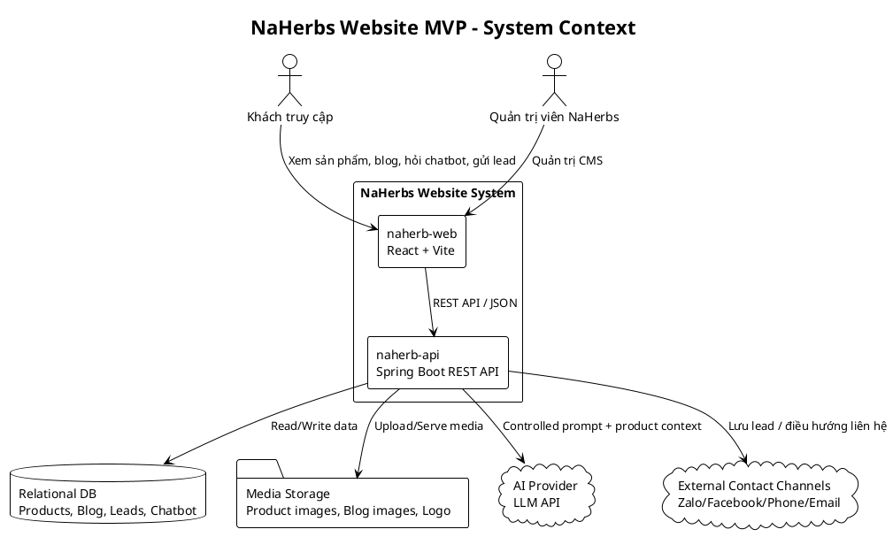

### 2.3 Container Diagram

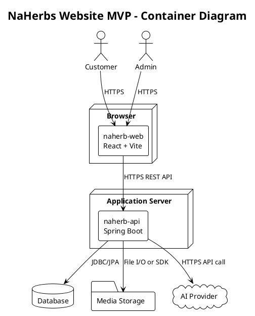

### 2.4 Deployment Diagram

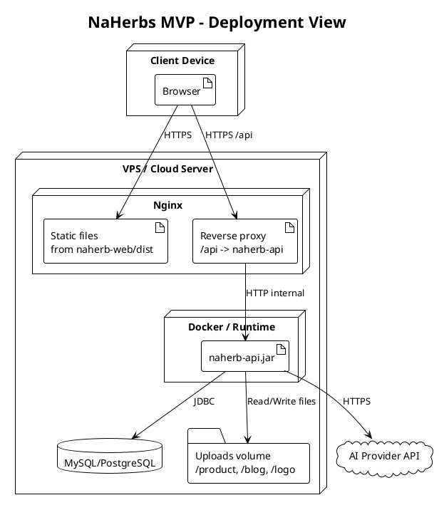

---

## 3. Repository và cấu trúc module

### 3.1 Repository tổng quan

```text
naherb/
├── naherb-api/          # Spring Boot backend
├── naherb-web/          # React + Vite frontend
├── docs/                # PRD, SRS, SDD, API docs
├── docker-compose.yml   # Local/dev deployment
└── README.md
```

Có thể tách thành 2 repository riêng nếu team muốn quản lý độc lập:

```text
naherb-api
naherb-web
```

### 3.2 Cấu trúc đề xuất cho `naherb-api`

```text
naherb-api/
├── src/main/java/com/naherb/api/
│   ├── NaherbApiApplication.java
│   ├── common/
│   │   ├── config/
│   │   ├── exception/
│   │   ├── response/
│   │   ├── security/
│   │   ├── validation/
│   │   └── util/
│   ├── auth/
│   │   ├── controller/
│   │   ├── dto/
│   │   ├── service/
│   │   └── entity/
│   ├── product/
│   │   ├── controller/
│   │   ├── dto/
│   │   ├── entity/
│   │   ├── repository/
│   │   └── service/
│   ├── blog/
│   ├── lead/
│   ├── media/
│   ├── chatbot/
│   │   ├── controller/
│   │   ├── dto/
│   │   ├── entity/
│   │   ├── repository/
│   │   ├── service/
│   │   ├── provider/
│   │   └── guardrail/
│   └── setting/
├── src/main/resources/
│   ├── application.yml
│   └── db/migration/
└── pom.xml
```

### 3.3 Cấu trúc đề xuất cho `naherb-web`

```text
naherb-web/
├── src/
│   ├── app/
│   │   ├── router.tsx
│   │   ├── providers.tsx
│   │   └── config.ts
│   ├── assets/
│   ├── components/
│   │   ├── common/
│   │   ├── layout/
│   │   ├── product/
│   │   ├── blog/
│   │   ├── lead/
│   │   └── chatbot/
│   ├── features/
│   │   ├── public-home/
│   │   ├── public-products/
│   │   ├── public-blog/
│   │   ├── public-chatbot/
│   │   ├── admin-auth/
│   │   ├── admin-products/
│   │   ├── admin-blog/
│   │   ├── admin-leads/
│   │   └── admin-chatbot/
│   ├── services/
│   │   ├── apiClient.ts
│   │   ├── productApi.ts
│   │   ├── blogApi.ts
│   │   ├── leadApi.ts
│   │   └── chatbotApi.ts
│   ├── types/
│   ├── hooks/
│   ├── utils/
│   └── main.tsx
├── public/
├── index.html
├── vite.config.ts
└── package.json
```

---

## 4. Backend Design – `naherb-api`

### 4.1 Layered Architecture

Backend sử dụng layered architecture:

| Layer | Vai trò |
|---|---|
| Controller | Nhận HTTP request, validate input, trả response |
| DTO/Mapper | Chuyển đổi request/response với entity |
| Service | Xử lý nghiệp vụ |
| Repository | Truy cập database qua Spring Data JPA |
| Entity | Mapping bảng database |
| Security | JWT, password hashing, CORS, authorization |
| Integration/Provider | Tích hợp AI provider, media storage, external service |

### 4.2 Backend Component Diagram

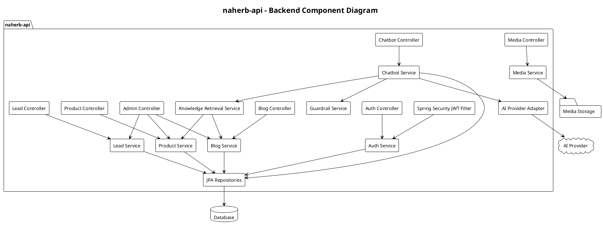

### 4.3 Backend modules

#### 4.3.1 Auth Module

Chức năng:

- Admin login.
- JWT access token.
- Password hashing bằng BCrypt.
- Phân quyền admin theo role.

Endpoint chính:

| Method | Endpoint | Auth | Mô tả |
|---|---|---|---|
| POST | `/api/v1/admin/auth/login` | Public | Đăng nhập admin |
| GET | `/api/v1/admin/auth/me` | Admin | Lấy thông tin admin hiện tại |
| POST | `/api/v1/admin/auth/logout` | Admin | Logout phía client/token blacklist nếu triển khai |

#### 4.3.2 Product Module

Chức năng:

- Quản lý danh mục sản phẩm.
- Quản lý sản phẩm, slug, mô tả ngắn/dài, SEO metadata.
- Quản lý biến thể: màu, mùi, phiên bản có nhiệt/không nhiệt, giá gạch, giá bán, tồn kho hiển thị.
- Quản lý ảnh sản phẩm.
- Public API để website hiển thị catalog.
- Product retrieval cho chatbot.

Endpoint public:

| Method | Endpoint | Mô tả |
|---|---|---|
| GET | `/api/v1/products` | Danh sách sản phẩm publish |
| GET | `/api/v1/products/{slug}` | Chi tiết sản phẩm |
| GET | `/api/v1/product-categories` | Danh sách danh mục |
| GET | `/api/v1/products/search` | Tìm kiếm/lọc sản phẩm |

Endpoint admin:

| Method | Endpoint | Mô tả |
|---|---|---|
| POST | `/api/v1/admin/products` | Tạo sản phẩm |
| PUT | `/api/v1/admin/products/{id}` | Cập nhật sản phẩm |
| PATCH | `/api/v1/admin/products/{id}/publish` | Publish/unpublish |
| DELETE | `/api/v1/admin/products/{id}` | Soft delete |
| POST | `/api/v1/admin/products/{id}/variants` | Tạo biến thể |
| PUT | `/api/v1/admin/product-variants/{variantId}` | Cập nhật biến thể |
| POST | `/api/v1/admin/products/{id}/images` | Upload/gán ảnh sản phẩm |

#### 4.3.3 Blog Module

Chức năng:

- Quản lý bài blog SEO.
- Quản lý category/tag blog.
- Public API hiển thị bài viết.
- Cung cấp nội dung tham khảo cho chatbot.

Endpoint public:

| Method | Endpoint | Mô tả |
|---|---|---|
| GET | `/api/v1/blog-posts` | Danh sách blog publish |
| GET | `/api/v1/blog-posts/{slug}` | Chi tiết blog |
| GET | `/api/v1/blog-categories` | Danh mục blog |

Endpoint admin:

| Method | Endpoint | Mô tả |
|---|---|---|
| POST | `/api/v1/admin/blog-posts` | Tạo bài viết |
| PUT | `/api/v1/admin/blog-posts/{id}` | Cập nhật bài viết |
| PATCH | `/api/v1/admin/blog-posts/{id}/publish` | Publish/unpublish |
| DELETE | `/api/v1/admin/blog-posts/{id}` | Soft delete |

#### 4.3.4 Lead Module

Chức năng:

- Nhận yêu cầu tư vấn/đặt mua nhanh.
- Lưu thông tin khách hàng, nhu cầu, sản phẩm quan tâm.
- Admin xem, cập nhật trạng thái xử lý lead.
- Lead có thể được tạo từ form hoặc từ chatbot.

Endpoint public:

| Method | Endpoint | Mô tả |
|---|---|---|
| POST | `/api/v1/leads` | Gửi yêu cầu tư vấn/đặt mua |

Endpoint admin:

| Method | Endpoint | Mô tả |
|---|---|---|
| GET | `/api/v1/admin/leads` | Danh sách lead |
| GET | `/api/v1/admin/leads/{id}` | Chi tiết lead |
| PATCH | `/api/v1/admin/leads/{id}/status` | Cập nhật trạng thái |
| POST | `/api/v1/admin/leads/{id}/notes` | Thêm ghi chú xử lý |

#### 4.3.5 Media Module

Chức năng:

- Upload ảnh sản phẩm, ảnh blog, logo/banner.
- Kiểm tra định dạng file.
- Sinh URL public.
- Xóa/ẩn media không dùng.

Ràng buộc MVP:

- Cho phép `.jpg`, `.jpeg`, `.png`, `.webp`.
- Giới hạn dung lượng mỗi file, ví dụ 5MB.
- Lưu theo folder logic: `/products`, `/blog`, `/site`.
- Không cho upload script/html/svg không kiểm soát.

#### 4.3.6 Chatbot Module

Chức năng:

- Nhận câu hỏi từ người dùng.
- Lưu conversation/message nếu được cấu hình.
- Phân tích nhu cầu sản phẩm.
- Truy xuất sản phẩm/blog liên quan từ database.
- Tạo controlled prompt gửi AI provider.
- Validate câu trả lời để không bịa sản phẩm/giá/tồn kho/claim y tế.
- Trả về câu trả lời + product cards + CTA.

Endpoint public:

| Method | Endpoint | Mô tả |
|---|---|---|
| POST | `/api/v1/chatbot/conversations` | Tạo conversation mới |
| POST | `/api/v1/chatbot/messages` | Gửi tin nhắn và nhận phản hồi |
| GET | `/api/v1/chatbot/suggestions` | Câu hỏi gợi ý ban đầu |

Endpoint admin:

| Method | Endpoint | Mô tả |
|---|---|---|
| GET | `/api/v1/admin/chatbot/config` | Xem cấu hình chatbot |
| PUT | `/api/v1/admin/chatbot/config` | Cập nhật cấu hình chatbot |
| GET | `/api/v1/admin/chatbot/conversations` | Xem lịch sử hội thoại |
| GET | `/api/v1/admin/chatbot/conversations/{id}` | Chi tiết hội thoại |

---

## 5. Frontend Design – `naherb-web`

### 5.1 Frontend Architecture

Frontend sử dụng React + Vite với cách tổ chức theo feature.

Các nhóm chính:

| Nhóm | Vai trò |
|---|---|
| `app` | Router, provider, cấu hình toàn app |
| `components` | Component tái sử dụng |
| `features/public-*` | Trang khách hàng |
| `features/admin-*` | Trang quản trị |
| `services` | API client gọi `naherb-api` |
| `types` | TypeScript type/interface |
| `hooks` | Custom React hooks |
| `utils` | Helper format tiền, slug, date, validation |

### 5.2 Frontend Component Diagram

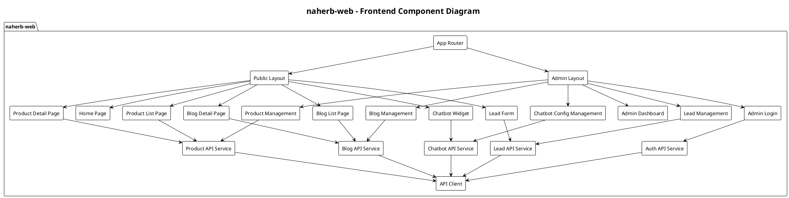

### 5.3 Public Website Pages

| Page | Route đề xuất | Mô tả |
|---|---|---|
| Trang chủ | `/` | Hero, sản phẩm nổi bật, lợi ích, CTA, blog nổi bật |
| Giới thiệu | `/ve-naherbs` | Câu chuyện thương hiệu, giá trị, cam kết |
| Danh sách sản phẩm | `/san-pham` | Grid/list sản phẩm, filter, search |
| Chi tiết sản phẩm | `/san-pham/:slug` | Ảnh, giá, biến thể, mô tả, hướng dẫn dùng, CTA |
| Blog | `/blog` | Danh sách bài viết SEO |
| Chi tiết blog | `/blog/:slug` | Nội dung bài viết, sản phẩm liên quan |
| Liên hệ | `/lien-he` | Form lead, thông tin Zalo/Facebook/Phone |

### 5.4 Admin Pages

| Page | Route đề xuất | Mô tả |
|---|---|---|
| Login | `/admin/login` | Đăng nhập admin |
| Dashboard | `/admin` | Tổng quan sản phẩm, blog, lead |
| Quản lý sản phẩm | `/admin/products` | CRUD sản phẩm |
| Quản lý biến thể | `/admin/products/:id/variants` | CRUD variant |
| Quản lý media | `/admin/media` | Upload/xóa ảnh |
| Quản lý blog | `/admin/blog-posts` | CRUD blog |
| Quản lý lead | `/admin/leads` | Xem và xử lý lead |
| Cấu hình chatbot | `/admin/chatbot` | Cấu hình disclaimer, prompt rule, suggested questions |
| Cấu hình website | `/admin/settings` | Logo, hotline, Zalo, Facebook, SEO default |

### 5.5 Chatbot UI Design

Chatbot là widget nổi ở góc phải dưới màn hình.

Thành phần UI:

- Floating button.
- Chat window.
- Welcome message.
- Suggested questions.
- Message list.
- Input box.
- Product recommendation cards.
- CTA: “Xem sản phẩm”, “Nhận tư vấn”, “Liên hệ Zalo”.
- Disclaimer: nội dung tư vấn chỉ mang tính tham khảo, không thay thế tư vấn y tế.

Trạng thái UI:

| State | Mô tả |
|---|---|
| Idle | Chưa mở widget |
| Opened | Hiển thị lời chào và câu hỏi gợi ý |
| Sending | Người dùng gửi câu hỏi |
| Loading | Đang chờ API trả lời |
| Answered | Hiển thị câu trả lời và product cards |
| Error | Hiển thị lỗi thân thiện, cho phép thử lại |
| Lead CTA | Gợi ý để lại số điện thoại/Zalo khi người dùng muốn tư vấn sâu |

---

## 6. Database Design

### 6.1 Entity Relationship Diagram

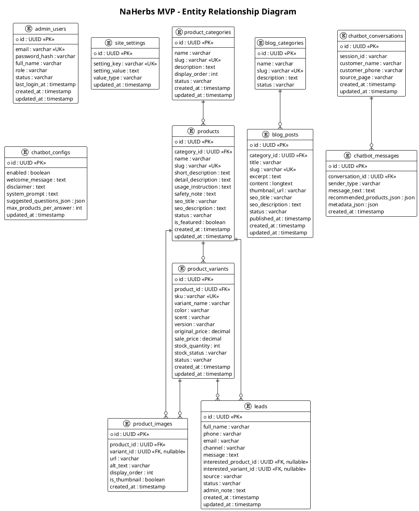

### 6.2 Entity mô tả ngắn

#### Product

Đại diện một sản phẩm chính, ví dụ: “Gối Công Thái Học Thảo Dược NaHerbs”. Product chứa thông tin SEO, mô tả và trạng thái publish.

#### ProductVariant

Đại diện biến thể bán hàng cụ thể, ví dụ:

- Phiên bản Có Nhiệt / Không Nhiệt.
- Màu Be / Nâu Chùa.
- Mùi Quế Hồi / Chanh Sả.
- Điếu Ngắn / Điếu Dài.

Variant là nơi lưu giá, giá gạch, tồn kho và trạng thái còn hàng.

#### BlogPost

Đại diện bài viết SEO/tư vấn. Blog có thể được chatbot dùng làm ngữ cảnh tham khảo nhưng không được dùng để tạo claim y tế vượt quá nội dung đã duyệt.

#### Lead

Thông tin khách hàng để lại từ form liên hệ hoặc chatbot. Lead có trạng thái xử lý để admin theo dõi.

#### ChatbotConversation và ChatbotMessage

Lưu lịch sử hội thoại ở mức MVP nhằm:

- Theo dõi câu hỏi phổ biến.
- Nâng cao chất lượng tư vấn.
- Chuyển hội thoại thành lead khi người dùng để lại thông tin.

---

## 7. API Design

### 7.1 Response format chuẩn

```json
{
  "success": true,
  "message": "OK",
  "data": {},
  "errors": []
}
```

Khi lỗi validation:

```json
{
  "success": false,
  "message": "Validation failed",
  "data": null,
  "errors": [
    {
      "field": "phone",
      "message": "Số điện thoại không hợp lệ"
    }
  ]
}
```

### 7.2 Public Product API

#### GET `/api/v1/products`

Query params:

| Param | Kiểu | Mô tả |
|---|---|---|
| `keyword` | string | Tìm theo tên/mô tả |
| `categorySlug` | string | Lọc danh mục |
| `need` | string | Nhu cầu: cổ vai gáy, đau lưng, ngủ, tinh dầu, ngải cứu |
| `inStockOnly` | boolean | Chỉ lấy sản phẩm còn hàng |
| `page` | number | Trang |
| `size` | number | Số item/trang |

Response data:

```json
{
  "items": [
    {
      "id": "uuid",
      "name": "Gối Công Thái Học Thảo Dược NaHerbs",
      "slug": "goi-cong-thai-hoc-thao-duoc-naherbs",
      "thumbnailUrl": "/uploads/products/pillow.webp",
      "shortDescription": "...",
      "minSalePrice": 399000,
      "maxSalePrice": 399000,
      "stockStatus": "IN_STOCK"
    }
  ],
  "page": 0,
  "size": 12,
  "total": 20
}
```

### 7.3 Chatbot API

#### POST `/api/v1/chatbot/messages`

Request:

```json
{
  "conversationId": "uuid-or-null",
  "sessionId": "browser-session-id",
  "message": "Tôi hay đau cổ vai gáy thì dùng sản phẩm nào?",
  "sourcePage": "/san-pham/goi-cong-thai-hoc-thao-duoc-naherbs"
}
```

Response:

```json
{
  "success": true,
  "message": "OK",
  "data": {
    "conversationId": "uuid",
    "answer": "Với nhu cầu cổ vai gáy, bạn có thể tham khảo...",
    "disclaimer": "Thông tin chỉ mang tính tham khảo, không thay thế tư vấn y tế.",
    "recommendedProducts": [
      {
        "id": "uuid",
        "name": "Gối Công Thái Học Thảo Dược NaHerbs",
        "slug": "goi-cong-thai-hoc-thao-duoc-naherbs",
        "thumbnailUrl": "/uploads/products/pillow.webp",
        "salePrice": 399000,
        "variantName": "Phiên bản Có Nhiệt",
        "stockStatus": "IN_STOCK",
        "reason": "Phù hợp nhu cầu nâng đỡ cổ vai gáy và thư giãn bằng thảo dược."
      }
    ],
    "suggestedActions": [
      {
        "type": "VIEW_PRODUCT",
        "label": "Xem sản phẩm",
        "url": "/san-pham/goi-cong-thai-hoc-thao-duoc-naherbs"
      },
      {
        "type": "CREATE_LEAD",
        "label": "Để lại số điện thoại tư vấn",
        "url": "/lien-he"
      }
    ]
  },
  "errors": []
}
```

### 7.4 Admin API bảo mật

Tất cả API `/api/v1/admin/**` yêu cầu JWT admin.

Header:

```http
Authorization: Bearer <access_token>
```

Quy tắc:

- Admin chưa đăng nhập không được truy cập CMS.
- Token hết hạn phải login lại.
- Các thao tác tạo/sửa/xóa phải ghi `created_at`, `updated_at`.
- Xóa dữ liệu quan trọng ưu tiên soft delete.

---

## 8. AI Chatbot Design

### 8.1 Mục tiêu chatbot

Chatbot đóng vai trò trợ lý tư vấn sản phẩm, giúp người dùng:

- Hỏi bằng ngôn ngữ tự nhiên.
- Nêu nhu cầu như cổ vai gáy, đau lưng, thư giãn mắt, xông ngải, tinh dầu.
- Nhận gợi ý sản phẩm hiện có trên website.
- Biết giá, biến thể, trạng thái còn hàng.
- Có CTA đi tới trang sản phẩm hoặc gửi lead.

### 8.2 Nguyên tắc thiết kế chatbot

| Nguyên tắc | Mô tả |
|---|---|
| Backend-controlled | Frontend không gọi LLM trực tiếp |
| Grounded by DB | Sản phẩm/giá/tồn kho lấy từ database, không lấy từ AI |
| Product cards deterministic | Card sản phẩm do backend tạo, AI chỉ viết phần giải thích |
| Safe health wording | Không nói chữa khỏi/điều trị dứt điểm/thay thế bác sĩ |
| Fallback | Nếu không đủ dữ liệu, hỏi thêm hoặc gợi ý liên hệ tư vấn |
| Admin configurable | Admin chỉnh welcome message, disclaimer, câu hỏi gợi ý, bật/tắt chatbot |

### 8.3 Chatbot Processing Sequence

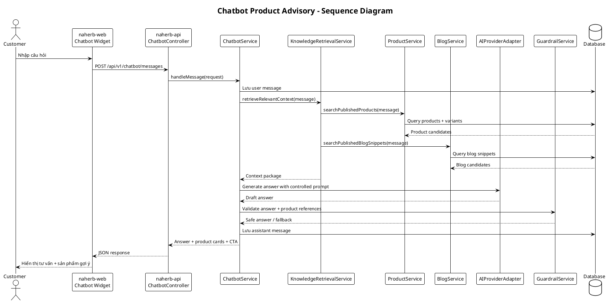

### 8.4 Chatbot retrieval strategy

MVP dùng chiến lược retrieval đơn giản, dễ triển khai:

1. Chuẩn hóa câu hỏi người dùng: lowercase, bỏ dấu nếu cần, tách keyword.
2. Mapping keyword nhu cầu sang nhóm sản phẩm:
   - “cổ”, “vai gáy”, “văn phòng” → gối công thái học, áo choàng chữ U, gối chữ U.
   - “lưng”, “bụng”, “chườm” → túi/gối chườm đa năng.
   - “mắt”, “ngủ”, “thư giãn mắt” → bịt mắt thảo dược.
   - “ngải”, “xông”, “đông y” → cốc xông, bộ xông, điếu ngải.
   - “thơm”, “tinh dầu”, “phòng”, “spa” → tinh dầu.
3. Query `products` và `product_variants` theo:
   - `status = PUBLISHED`.
   - Variant còn active.
   - Ưu tiên `stock_status = IN_STOCK`.
   - Match theo name, short description, detail description, category, variant.
4. Lấy tối đa `max_products_per_answer`, ví dụ 3 sản phẩm.
5. Gửi context rút gọn cho AI:
   - Tên sản phẩm.
   - Biến thể.
   - Giá bán.
   - Tồn kho/trạng thái.
   - Mô tả ngắn.
   - URL slug.
   - Safety note.
6. Backend tự tạo product cards từ DB, không lấy product cards từ AI response.

### 8.5 Prompt contract

System prompt cần có nội dung tối thiểu:

```text
Bạn là trợ lý tư vấn sản phẩm cho website NaHerbs.
Chỉ tư vấn dựa trên danh sách sản phẩm và nội dung được cung cấp trong context.
Không tự tạo sản phẩm, giá, tồn kho, biến thể hoặc công dụng không có trong context.
Không đưa ra khẳng định y tế như chữa khỏi, điều trị dứt điểm, thay thế bác sĩ hoặc thuốc.
Nếu câu hỏi liên quan bệnh lý nghiêm trọng, hãy khuyên người dùng tham khảo chuyên gia y tế.
Câu trả lời phải ngắn gọn, thân thiện, tiếng Việt, ưu tiên gợi ý sản phẩm còn hàng.
```

### 8.6 Guardrail rules

| Rule ID | Rule |
|---|---|
| AI-BR-01 | Không trả lời sản phẩm ngoài danh mục publish |
| AI-BR-02 | Không tự bịa giá, tồn kho, biến thể |
| AI-BR-03 | Không nói “chữa khỏi”, “điều trị dứt điểm”, “thay thuốc/bác sĩ” |
| AI-BR-04 | Nếu không có sản phẩm phù hợp, hỏi thêm nhu cầu hoặc gợi ý liên hệ tư vấn |
| AI-BR-05 | Sản phẩm hết hàng không được ưu tiên, nếu nhắc đến phải nói rõ trạng thái |
| AI-BR-06 | Mọi câu trả lời liên quan sức khỏe phải có disclaimer ngắn |
| AI-BR-07 | Không yêu cầu người dùng cung cấp thông tin nhạy cảm không cần thiết |
| AI-BR-08 | Số điện thoại/email từ chatbot chỉ dùng để tạo lead tư vấn |

### 8.7 Chatbot fallback cases

| Tình huống | Xử lý |
|---|---|
| AI provider lỗi | Trả lời fallback: “Hiện chatbot chưa phản hồi được, bạn có thể để lại số điện thoại/Zalo...” |
| Không tìm thấy sản phẩm | Hỏi thêm nhu cầu hoặc gợi ý xem toàn bộ danh mục |
| Câu hỏi y tế nghiêm trọng | Từ chối chẩn đoán, khuyên gặp chuyên gia y tế, chỉ gợi ý sản phẩm thư giãn nếu phù hợp |
| Người dùng hỏi giá | Trả giá từ DB, không lấy từ AI |
| Người dùng hỏi tồn kho | Trả `stock_status` từ DB |
| Người dùng hỏi sản phẩm không có | Nói hiện website chưa có sản phẩm đó, gợi ý sản phẩm liên quan nếu có |

---

## 9. Key Sequence Diagrams

### 9.1 Public product browsing

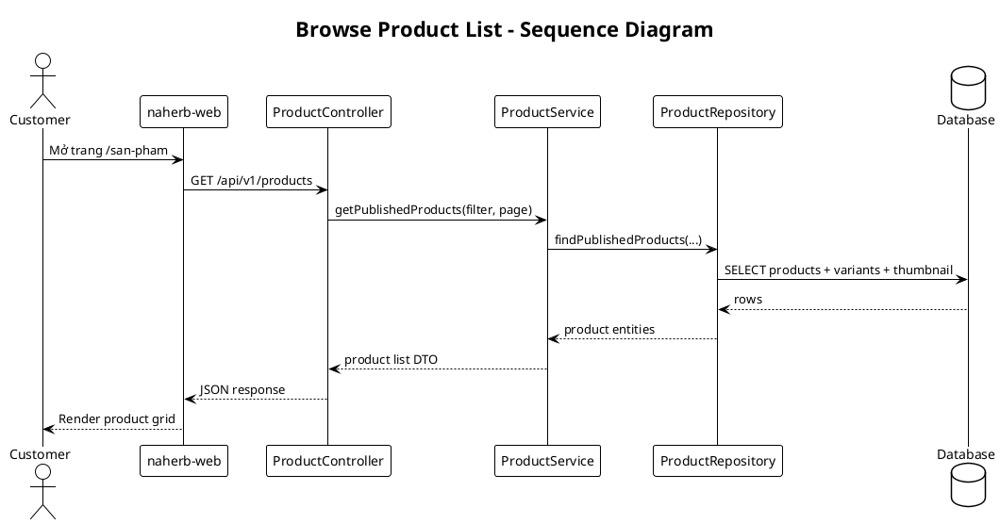

### 9.2 Admin creates product

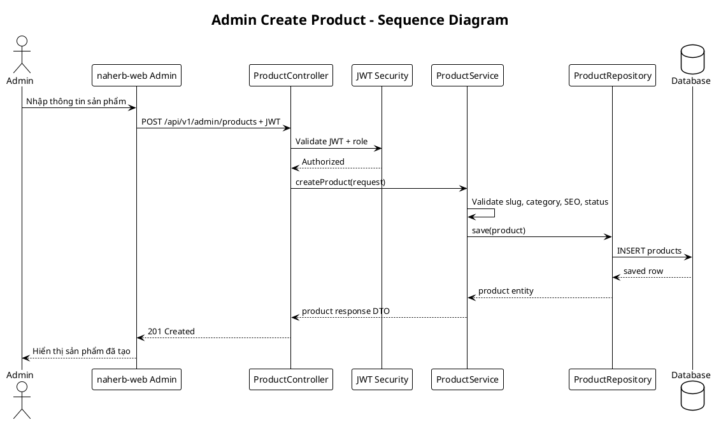

### 9.3 Lead submission

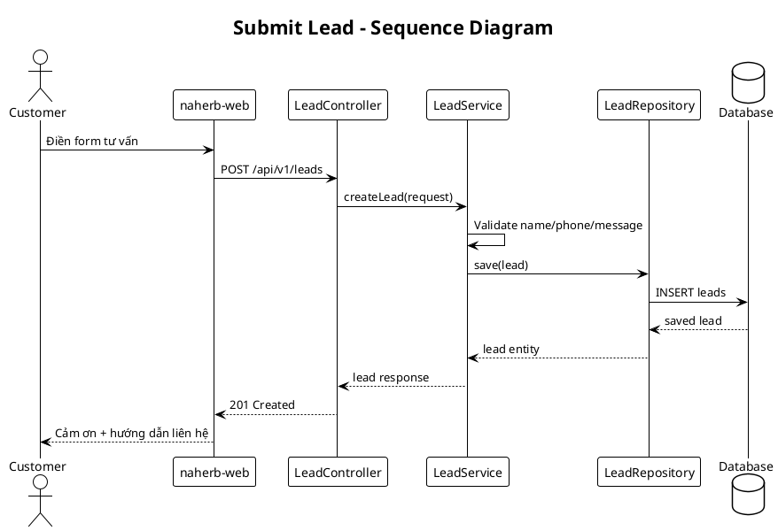

### 9.4 Admin publishes blog post

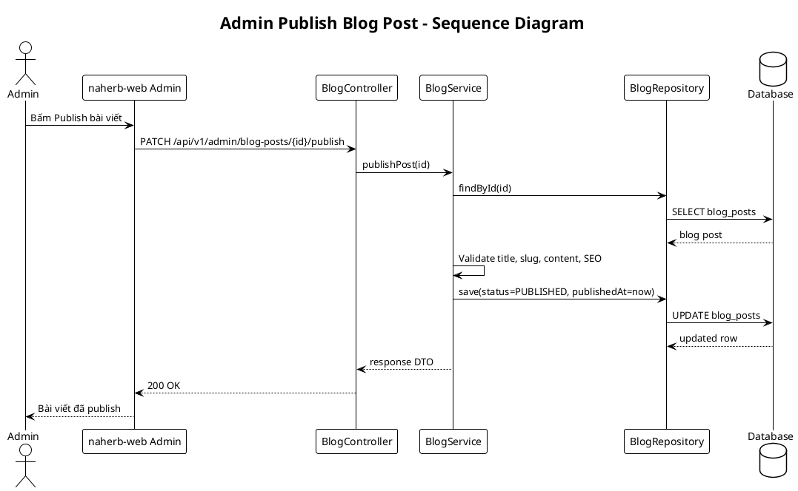

---

## 10. Security Design

### 10.1 Authentication & Authorization

- Public website API không cần login.
- Admin API yêu cầu JWT.
- Password admin lưu bằng BCrypt hash.
- Token đặt trong memory/localStorage tùy FE, khuyến nghị ưu tiên HTTP-only cookie nếu triển khai production kỹ hơn.
- Admin role tối thiểu:
  - `SUPER_ADMIN`: toàn quyền.
  - `CONTENT_ADMIN`: quản lý sản phẩm, blog, media, lead.

### 10.2 API Security

| Rủi ro | Thiết kế giảm thiểu |
|---|---|
| Unauthorized admin access | JWT + role-based access |
| CORS sai | Chỉ allow domain frontend production |
| Upload file độc hại | Whitelist MIME/extension, limit size, đổi filename |
| XSS trong blog | Sanitize HTML hoặc dùng markdown renderer an toàn |
| Spam lead/chatbot | Rate limiting theo IP/session |
| Lộ AI key | AI key chỉ nằm ở backend env |
| Prompt injection | Backend chỉ truyền context đã lọc, guardrail output |

### 10.3 Chatbot Security

- Không đưa secret/API key xuống frontend.
- Không truyền toàn bộ database vào prompt.
- Không cho user override system prompt.
- Log prompt/response ở mức kiểm soát, tránh lưu dữ liệu nhạy cảm quá mức.
- Rate limit endpoint chatbot để tránh abuse/cost spike.

---

## 11. Error Handling Design

### 11.1 Backend exception mapping

| Exception | HTTP Status | Response |
|---|---:|---|
| Validation error | 400 | Field errors |
| Unauthorized | 401 | Login required |
| Forbidden | 403 | Not enough permission |
| Resource not found | 404 | Entity not found |
| Duplicate slug/email | 409 | Conflict |
| File too large/invalid | 400 | Upload error |
| AI provider unavailable | 503 | Chatbot fallback |
| Unexpected error | 500 | Generic error, log detail server-side |

### 11.2 Frontend error handling

- API client bắt lỗi chung.
- Form hiển thị lỗi theo field.
- Product/blog not found hiển thị trang 404.
- Chatbot lỗi hiển thị fallback nhẹ nhàng, không show stack trace.
- Admin token hết hạn tự redirect về `/admin/login`.

---

## 12. Non-functional Design

### 12.1 Performance

- Product list API phân trang.
- Blog list API phân trang.
- Ảnh dùng WebP nếu có thể.
- Lazy load ảnh sản phẩm/blog.
- Cache public data ngắn hạn ở frontend hoặc CDN.
- Chatbot giới hạn context và số sản phẩm trả về.

### 12.2 SEO

React SPA cần hỗ trợ SEO tối thiểu bằng:

- Meta title/description theo page.
- Open Graph tags.
- Slug thân thiện.
- Sitemap XML generate từ backend hoặc build script.
- Robots.txt.
- Nội dung sản phẩm/blog render nhanh.

Nếu SEO là mục tiêu rất quan trọng, giai đoạn sau nên cân nhắc SSR/SSG bằng Next.js. Với MVP React + Vite, cần tối ưu metadata và indexability ở mức cơ bản.

### 12.3 Maintainability

- Tách module theo domain.
- DTO rõ ràng, không expose entity trực tiếp.
- API versioning `/api/v1`.
- Migration database bằng Flyway/Liquibase.
- Coding convention nhất quán.
- Unit test service chính.
- Integration test cho API quan trọng.

### 12.4 Observability

- Backend log request/error ở mức phù hợp.
- Log chatbot provider latency và lỗi.
- Không log raw secret/token.
- Có health check endpoint:

```http
GET /api/v1/health
```

---

## 13. Configuration Design

### 13.1 Backend environment variables

| Env | Mô tả |
|---|---|
| `SERVER_PORT` | Port backend |
| `DB_URL` | JDBC URL |
| `DB_USERNAME` | DB username |
| `DB_PASSWORD` | DB password |
| `JWT_SECRET` | Secret ký JWT |
| `JWT_EXPIRATION_MINUTES` | Thời hạn token |
| `UPLOAD_DIR` | Folder lưu file upload |
| `PUBLIC_BASE_URL` | URL public website |
| `CORS_ALLOWED_ORIGINS` | Domain frontend được phép gọi API |
| `AI_PROVIDER` | Provider AI: openai/gemini/none |
| `AI_API_KEY` | API key AI provider |
| `AI_MODEL` | Model dùng cho chatbot |
| `CHATBOT_ENABLED` | Bật/tắt chatbot |

### 13.2 Frontend environment variables

| Env | Mô tả |
|---|---|
| `VITE_API_BASE_URL` | Base URL của `naherb-api` |
| `VITE_SITE_NAME` | Tên website |
| `VITE_PUBLIC_BASE_URL` | URL public frontend |

---

## 14. Data Flow Design

### 14.1 Product data flow

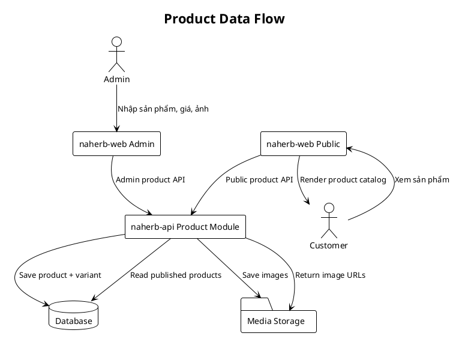

### 14.2 Chatbot data flow

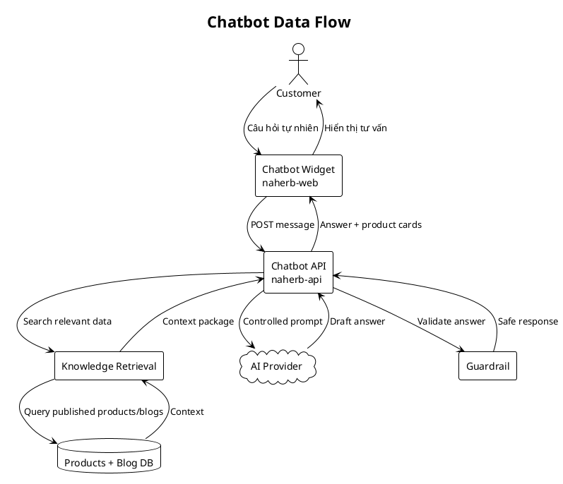

---

## 15. Detailed Class Design

### 15.1 Product domain class diagram

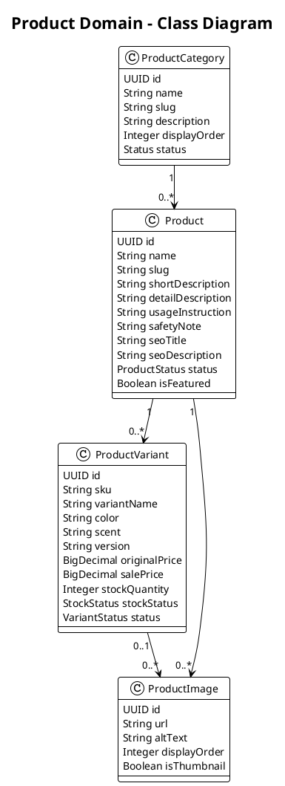

### 15.2 Chatbot domain class diagram

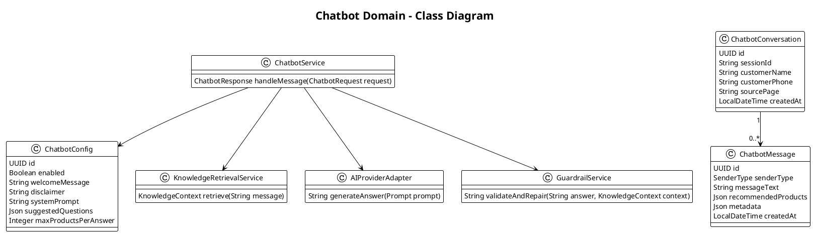

---

## 16. UI/UX Design Notes

### 16.1 Public website

Nguyên tắc:

- Giao diện nhẹ, dễ đọc, tập trung vào niềm tin thương hiệu.
- CTA rõ ràng: Zalo, gọi điện, để lại thông tin.
- Product card hiển thị tối thiểu: ảnh, tên, giá bán, giá gạch, trạng thái, CTA.
- Product detail cần có mô tả, hướng dẫn dùng và lưu ý an toàn.
- Với nội dung sức khỏe, tránh ngôn ngữ cam kết điều trị.

### 16.2 Admin CMS

Nguyên tắc:

- Form đơn giản, có preview.
- Trạng thái publish/draft rõ ràng.
- Ảnh có alt text phục vụ SEO.
- Lead có trạng thái xử lý: `NEW`, `CONTACTED`, `IN_PROGRESS`, `CLOSED`, `INVALID`.
- Chatbot config có nút bật/tắt khẩn cấp.

### 16.3 Chatbot UX

- Lời chào ban đầu nên gợi ý các nhu cầu phổ biến:
  - “Tôi hay đau cổ vai gáy, nên dùng sản phẩm nào?”
  - “Tôi muốn chườm nóng vùng lưng/bụng thì chọn gì?”
  - “Tôi muốn sản phẩm thư giãn mắt trước khi ngủ.”
  - “Tôi muốn xông ngải tại nhà thì cần sản phẩm nào?”
- Câu trả lời nên ngắn, chia ý rõ.
- Product cards giúp người dùng click ngay, không phải đọc đoạn dài.
- Khi người dùng hỏi nhiều lần nhưng chưa chốt, chatbot nên gợi ý để lại số điện thoại/Zalo.

---

## 17. Testing Design

### 17.1 Backend tests

| Test type | Module | Mục tiêu |
|---|---|---|
| Unit test | ProductService | Tạo/sửa/lọc sản phẩm đúng rule |
| Unit test | BlogService | Publish blog đúng điều kiện |
| Unit test | LeadService | Validate lead và lưu đúng source |
| Unit test | KnowledgeRetrievalService | Mapping nhu cầu → sản phẩm phù hợp |
| Unit test | GuardrailService | Chặn claim y tế/sản phẩm bịa |
| Integration test | Product API | Public list/detail hoạt động |
| Integration test | Admin API | JWT required |
| Integration test | Chatbot API | Trả product cards từ DB |

### 17.2 Frontend tests

| Test type | Khu vực | Mục tiêu |
|---|---|---|
| Component test | ProductCard | Hiển thị giá/trạng thái đúng |
| Component test | LeadForm | Validate phone/name/message |
| Component test | ChatbotWidget | Loading/error/answered states |
| E2E | Public catalog | User xem danh sách và chi tiết sản phẩm |
| E2E | Lead | User gửi form tư vấn thành công |
| E2E | Admin product | Admin tạo/sửa/publish sản phẩm |

### 17.3 Chatbot acceptance tests

| Case | Input | Expected |
|---|---|---|
| Tư vấn cổ vai gáy | “Tôi đau cổ vai gáy” | Gợi ý sản phẩm liên quan cổ/vai/gáy còn hàng |
| Hỏi giá | “Gối công thái học giá bao nhiêu?” | Trả giá từ DB, không tự sinh giá |
| Hỏi sản phẩm không có | “Có thuốc trị đau khớp không?” | Nói website chưa có, không bịa sản phẩm |
| Claim y tế | “Có chữa khỏi thoát vị không?” | Không cam kết chữa khỏi, khuyên tham khảo chuyên gia |
| Hết hàng | Sản phẩm liên quan hết hàng | Không ưu tiên hoặc nói rõ hết hàng |
| AI lỗi | Provider timeout | Trả fallback, không crash UI |

---

## 18. Migration & Seed Data

### 18.1 Migration order đề xuất

```text
V1__create_admin_users.sql
V2__create_product_tables.sql
V3__create_blog_tables.sql
V4__create_lead_tables.sql
V5__create_site_settings.sql
V6__create_chatbot_tables.sql
V7__seed_initial_admin.sql
V8__seed_initial_site_settings.sql
```

### 18.2 Seed data

Seed data nên bao gồm:

- Admin mặc định cho môi trường dev.
- Site settings: hotline, Zalo, Facebook, logo placeholder.
- Chatbot config mặc định.
- Product categories cơ bản.
- Blog categories cơ bản.

Dữ liệu sản phẩm thật nên import từ Google Sheet sau khi chuẩn hóa.

---

## 19. Build & Deployment Design

### 19.1 Local development

```text
naherb-api:
- Java 17+
- Maven
- Spring Boot
- MySQL/PostgreSQL local hoặc Docker

naherb-web:
- Node.js LTS
- npm/pnpm
- Vite dev server
```

Luồng dev:

```text
naherb-web dev server: http://localhost:5173
naherb-api server:     http://localhost:8080
Database:              localhost:3306 hoặc 5432
```

### 19.2 Production deployment

Đề xuất MVP:

- Build `naherb-web` thành static files.
- Serve static bằng Nginx.
- Reverse proxy `/api` tới `naherb-api`.
- Backend chạy bằng Docker container hoặc systemd service.
- Database chạy container hoặc managed DB.
- Uploads mount ra volume bền vững.

Nginx route mẫu:

```nginx
location / {
  try_files $uri $uri/ /index.html;
}

location /api/ {
  proxy_pass http://naherb-api:8080/api/;
}

location /uploads/ {
  alias /var/www/naherb/uploads/;
}
```

---

## 20. Design Decisions & Trade-offs

| ADR | Quyết định | Lý do | Trade-off |
|---|---|---|---|
| ADR-01 | Tách `naherb-web` và `naherb-api` | Rõ trách nhiệm, dễ scale, đúng stack React + Spring | Cần xử lý CORS/proxy |
| ADR-02 | Backend modular monolith | MVP nhanh, dễ maintain | Chưa tách microservice |
| ADR-03 | Chatbot gọi AI qua backend | Bảo mật API key, kiểm soát dữ liệu | Backend phức tạp hơn |
| ADR-04 | Product cards do backend tạo | Tránh AI bịa giá/sản phẩm | AI response ít linh hoạt hơn |
| ADR-05 | MVP chưa có checkout | Giảm scope, tập trung lead/catalog | Chưa bán hàng tự động |
| ADR-06 | Dùng relational DB | Phù hợp catalog/CMS/lead | Semantic search cần mở rộng sau |

---

## 21. Open Questions

| Mã | Câu hỏi | Ảnh hưởng |
|---|---|---|
| OQ-01 | Chọn DB chính thức MySQL hay PostgreSQL? | Migration, hosting, search/vector về sau |
| OQ-02 | Có cần TypeScript bắt buộc cho `naherb-web` không? | Maintainability frontend |
| OQ-03 | Ảnh sẽ lưu local VPS hay object storage? | Deployment, backup, scale |
| OQ-04 | AI provider chính là OpenAI, Gemini hay provider khác? | Adapter, cost, latency |
| OQ-05 | Có cần lưu toàn bộ lịch sử chatbot không, lưu bao lâu? | Privacy, storage, analytics |
| OQ-06 | Lead từ chatbot có tự gửi notification email/Zalo cho admin không? | Tích hợp external service |
| OQ-07 | Website có cần SSR/SSG để SEO mạnh hơn không? | Có thể ảnh hưởng lựa chọn React/Vite thuần |

---

## 22. MVP Implementation Milestones

### Milestone 1 – Project foundation

- Khởi tạo `naherb-api` Spring Boot.
- Khởi tạo `naherb-web` React + Vite.
- Cấu hình Docker/local DB.
- Auth admin cơ bản.
- API response/error format.

### Milestone 2 – Product catalog & media

- Product/category/variant/image entities.
- Admin CRUD sản phẩm.
- Public product list/detail.
- Upload ảnh.

### Milestone 3 – Blog & SEO content

- Blog category/post entities.
- Admin CRUD blog.
- Public blog list/detail.
- SEO metadata.

### Milestone 4 – Lead/contact

- Public lead form.
- Admin lead management.
- CTA Zalo/phone/Facebook.

### Milestone 5 – AI Chatbot MVP

- Chatbot widget frontend.
- Chatbot API backend.
- Knowledge retrieval từ products/blogs.
- AI provider adapter.
- Guardrails.
- Product recommendation cards.
- Admin chatbot config.

### Milestone 6 – Hardening & deployment

- Validation, security, rate limit.
- Performance optimization.
- Testing.
- Docker/Nginx deployment.
- Seed/import dữ liệu thật.

---

## 23. Traceability với SRS

| SRS Area | SDD Design Section |
|---|---|
| Website khách hàng | Section 5, 7, 9, 16 |
| Admin/CMS | Section 4, 5, 7, 16 |
| Product catalog | Section 4.3.2, 6, 7.2, 9.1, 15.1 |
| Blog SEO | Section 4.3.3, 6, 9.4 |
| Lead/tư vấn | Section 4.3.4, 6, 9.3 |
| AI Chatbot | Section 4.3.6, 8, 14.2, 15.2, 17.3 |
| Security | Section 10 |
| Performance/SEO/Maintainability | Section 12 |
| Deployment | Section 19 |

---

## 24. Kết luận

Thiết kế SDD v1.0 xác định NaHerbs Website MVP gồm 2 phần chính: **`naherb-web` React + Vite** và **`naherb-api` Spring Boot**. Hệ thống được thiết kế theo hướng modular monolith cho backend và feature-based frontend để triển khai nhanh nhưng vẫn có khả năng mở rộng.

Điểm quan trọng nhất trong thiết kế là **AI Chatbot phải được backend kiểm soát**, chỉ tư vấn dựa trên sản phẩm/bài viết đã publish, product cards lấy từ database, đồng thời có guardrail để tránh bịa thông tin hoặc đưa ra claim y tế không phù hợp.
