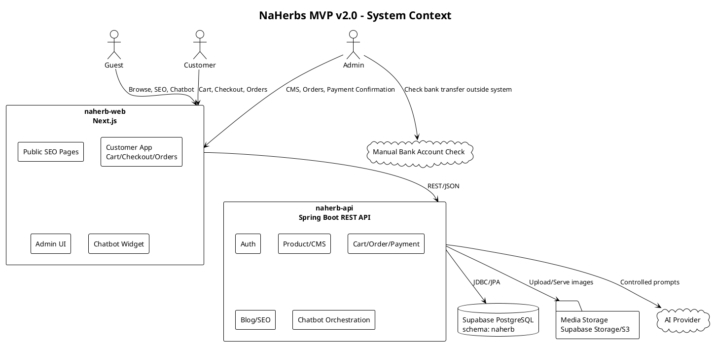
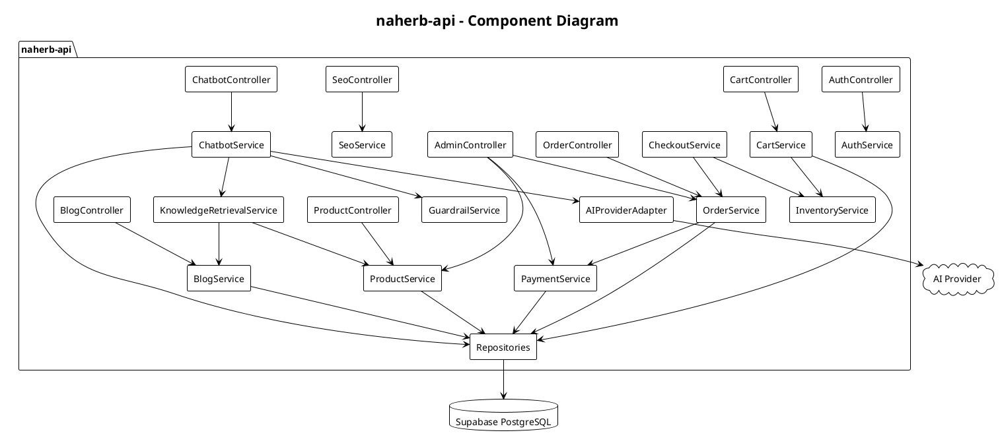
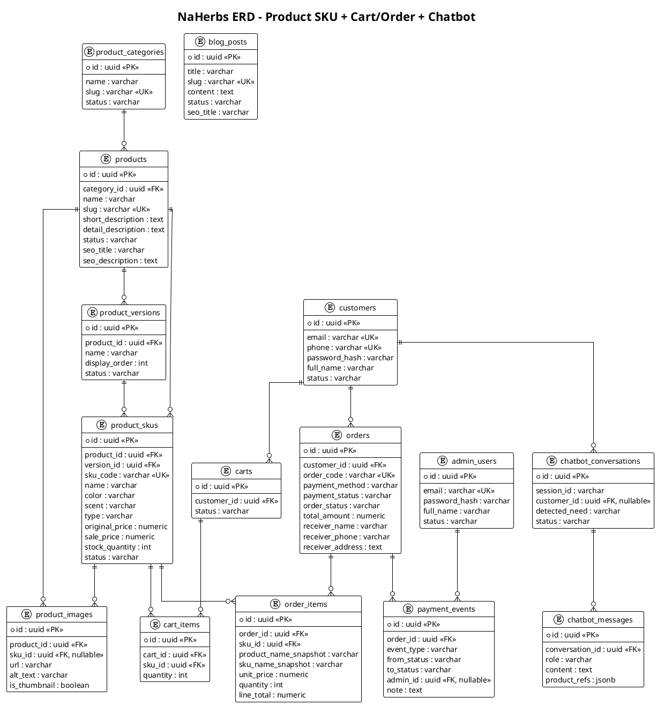
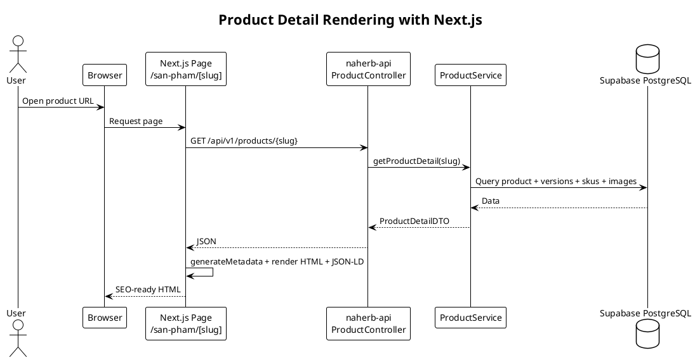
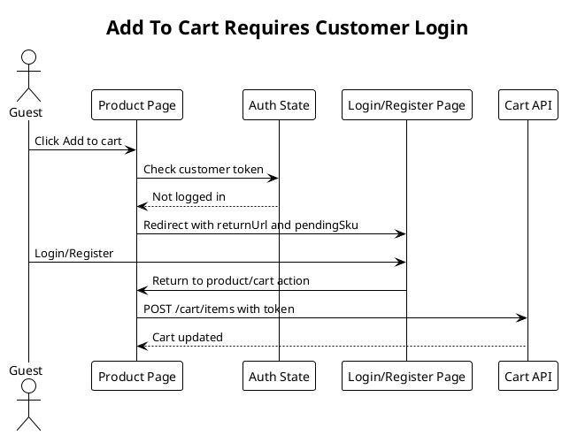
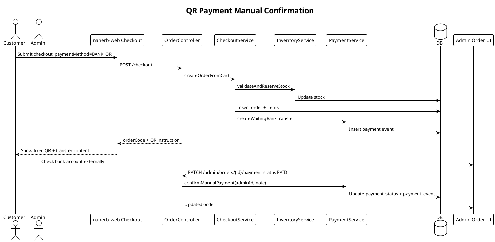
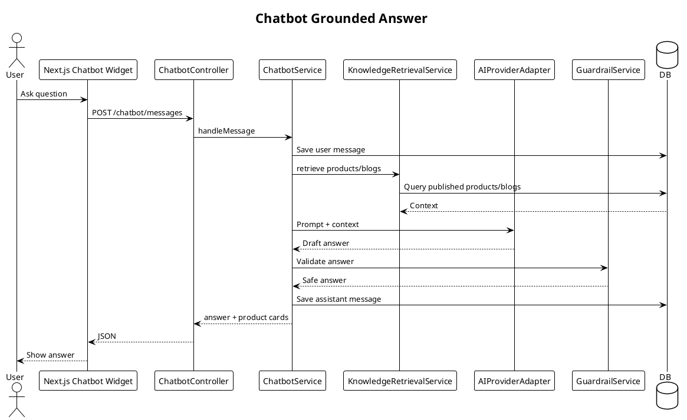

# SDD – NaHerbs Website MVP

**Dự án:** NaHerbs Website  
**Tài liệu:** Software Design Document (SDD)  
**Phiên bản:** v2.0 – Next.js Stack  
**Ngày cập nhật:** 2026-06-28  
**Backend:** `naherb-api` – Spring Boot REST API  
**Frontend:** `naherb-web` – Next.js  
**Database:** Supabase PostgreSQL

---

## 1. Mục đích

Tài liệu SDD mô tả thiết kế phần mềm cho NaHerbs Website MVP sau khi chuyển frontend từ React + Vite sang Next.js. Thiết kế tập trung vào SEO cho public pages, e-commerce MVP, COD/QR manual payment, admin CMS, chatbot AI và Supabase PostgreSQL.

---

## 2. Architecture overview

### 2.1 Architecture decision

Hệ thống dùng kiến trúc frontend/backend tách rời:

- `naherb-web`: Next.js, chịu trách nhiệm UI, SEO rendering, metadata, route organization.
- `naherb-api`: Spring Boot, chịu trách nhiệm REST API, auth, business rules, data persistence, chatbot orchestration.
- Supabase PostgreSQL: database chung.
- AI Provider: gọi qua backend adapter.

Next.js **không truy cập database trực tiếp**. Mọi dữ liệu đi qua `naherb-api`.

### 2.2 System Context Diagram



### 2.3 Container Diagram

```plantuml
@startuml
!theme plain
skinparam shadowing false
skinparam componentStyle rectangle
skinparam defaultFontName Arial

title NaHerbs MVP - Container Diagram

node "Browser" {
  artifact "Next.js rendered pages" as Browser
}

node "Web Runtime" {
  component "naherb-web\nNext.js App Router" as Next
}

node "API Runtime" {
  component "naherb-api\nSpring Boot" as Spring
}

database "Supabase PostgreSQL" as PG
folder "Media Storage" as Media
cloud "AI Provider" as AI

Browser --> Next : HTTPS pages/assets
Next --> Spring : Server-side fetch + client API calls
Spring --> PG : JDBC/JPA
Spring --> Media : Storage SDK / URL
Spring --> AI : HTTPS
@enduml
```

### 2.4 Deployment View

```plantuml
@startuml
!theme plain
skinparam shadowing false
skinparam defaultFontName Arial

title NaHerbs Deployment - Next.js + Spring Boot + Supabase

node "Client" {
  artifact "Browser" as Client
}

node "Web Hosting" {
  artifact "naherb-web\nNext.js" as Next
}

node "API Hosting" {
  artifact "naherb-api.jar\nSpring Boot" as API
}

cloud "Supabase" {
  database "PostgreSQL\nschema naherb" as DB
  folder "Storage Buckets" as Bucket
}

cloud "AI Provider" as AI

Client --> Next : HTTPS
Next --> API : HTTPS /api/v1
API --> DB : JDBC SSL
API --> Bucket : Media storage
API --> AI : HTTPS
@enduml
```

---

## 3. Repository design

```text
naherb/
├── naherb-api/             # Spring Boot backend
├── naherb-web/             # Next.js frontend
├── docs/                   # PRD, SRS, SDD, API contract, UI/UX
├── database/
│   └── supabase/           # SQL scripts chạy thủ công/versioned
└── README.md
```

### 3.1 `naherb-api` package structure

```text
com.naherb.api
├── common
│   ├── config
│   ├── exception
│   ├── response
│   ├── security
│   └── util
├── auth
├── customer
├── product
├── cart
├── order
├── payment
├── blog
├── media
├── chatbot
├── lead
├── seo
└── setting
```

### 3.2 `naherb-web` Next.js structure

```text
naherb-web/
├── src/
│   ├── app/
│   │   ├── page.tsx
│   │   ├── layout.tsx
│   │   ├── san-pham/
│   │   │   ├── page.tsx
│   │   │   └── [slug]/page.tsx
│   │   ├── danh-muc/[slug]/page.tsx
│   │   ├── blog/
│   │   │   ├── page.tsx
│   │   │   └── [slug]/page.tsx
│   │   ├── cart/page.tsx
│   │   ├── checkout/page.tsx
│   │   ├── account/orders/page.tsx
│   │   ├── admin/
│   │   ├── sitemap.ts
│   │   └── robots.ts
│   ├── components/
│   ├── features/
│   ├── services/
│   │   ├── api-client.ts
│   │   └── generated/       # generated from openapi.yml
│   ├── types/
│   └── utils/
├── public/
├── next.config.ts
└── package.json
```

---

## 4. Rendering design in Next.js

| Page group | Suggested rendering | Notes |
|---|---|---|
| Home | Server/Static render | SEO page |
| Product list/category | Server render | Fetch from API with pagination/filter |
| Product detail | Server render | Dynamic metadata, Product JSON-LD |
| Blog list/detail | Server render | Article metadata, JSON-LD |
| Cart/checkout/account | Client-heavy + noindex | Requires customer token |
| Admin | Client-heavy + noindex | Requires admin token |
| Chatbot widget | Client component | Calls backend chatbot API |

### 4.1 Next.js API calling rule

- Server Components call internal API URL: `API_BASE_URL`.
- Client Components call public API URL or same-domain proxy: `NEXT_PUBLIC_API_BASE_URL`.
- All business validation remains in Spring Boot.

### 4.2 SEO responsibilities

Next.js implements:

- `generateMetadata()` for dynamic product/blog metadata.
- `app/sitemap.ts` fetches published slugs from `GET /api/v1/seo/sitemap-data`.
- `app/robots.ts` marks admin/cart/checkout/account noindex.
- JSON-LD components for Product, Article, Breadcrumb.

---

## 5. Backend design

### 5.1 Layered architecture

| Layer | Responsibility |
|---|---|
| Controller | REST endpoints, request validation |
| DTO/Mapper | Request/response shape |
| Service | Business rules |
| Repository | Spring Data JPA |
| Entity | PostgreSQL table mapping |
| Security | JWT, password hash, role/customer separation |
| Integration | AI provider, media storage |

### 5.2 Backend Component Diagram



---

## 6. Database design

### 6.1 ERD



### 6.2 Supabase schema management

- Schema name: `naherb`.
- SQL scripts đặt trong `database/supabase/`.
- Không dùng Flyway auto migration.
- Spring Boot config production:

```yaml
spring:
  jpa:
    hibernate:
      ddl-auto: validate
    properties:
      hibernate:
        default_schema: naherb
```

---

## 7. Key sequence diagrams

### 7.1 Product detail SEO rendering



### 7.2 Add cart requires login



### 7.3 Checkout QR manual payment



### 7.4 Chatbot answer



---

## 8. API design summary

- Public APIs: health, products, categories, blogs, chatbot suggestions, site settings.
- Customer APIs: auth, cart, checkout, my orders.
- Admin APIs: auth, product CMS, SKU, blog CMS, order management, payment confirmation, chatbot config.
- SEO APIs: sitemap data, product/blog SEO payload.

Detailed contract is in `api-contract.md` and `openapi.yml`.

---

## 9. Security design

### 9.1 Auth model

- Customer token and admin token share JWT mechanism but distinguish subject type/role.
- Admin endpoint prefix: `/api/v1/admin/**`.
- Customer endpoint prefix: `/api/v1/cart`, `/api/v1/checkout`, `/api/v1/orders/my`.
- Public endpoint no auth.

### 9.2 Frontend noindex routes

Next.js must mark these noindex:

```text
/cart
/checkout
/account/**
/admin/**
/login
/register
```

### 9.3 Manual QR confirmation audit

Every admin payment confirmation writes a `payment_events` record:

- order id
- old status
- new status
- admin id
- note
- timestamp

---

## 10. Error handling

| Case | HTTP | Handling |
|---|---:|---|
| Validation error | 400 | Field errors |
| Unauthorized | 401 | Login required |
| Forbidden | 403 | Not allowed |
| Not found | 404 | Resource not found |
| Conflict | 409 | Duplicate slug/email/order state conflict |
| Insufficient stock | 409 | Show stock error to user |
| AI provider unavailable | 503 | Chatbot fallback |
| Unexpected | 500 | Generic message, server log |

---

## 11. Testing design

### 11.1 Backend

- Product/SKU service unit tests.
- Inventory/checkout transaction tests.
- Order/payment status transition tests.
- Admin payment confirmation tests.
- Auth access control tests.
- Chatbot retrieval/guardrail tests.

### 11.2 Frontend

- Product detail SKU selection tests.
- Cart/checkout flow tests.
- QR instruction UI tests.
- SEO metadata tests for product/blog.
- Admin order/payment UI tests.

### 11.3 E2E critical flows

1. Guest opens product from URL → SEO page renders → login → add cart.
2. Customer checkout COD.
3. Customer checkout QR → admin confirms paid.
4. Admin creates product/version/SKU → public product page updates.
5. Chatbot suggests valid product cards.

---

## 12. Build & deployment

### 12.1 Local dev

```text
naherb-api:  http://localhost:8080
naherb-web:  http://localhost:3000
Supabase:    remote project or local Supabase
```

### 12.2 Environment variables

#### `naherb-api`

```text
DB_URL
DB_USERNAME
DB_PASSWORD
JWT_SECRET
UPLOAD_PROVIDER
AI_PROVIDER
AI_API_KEY
AI_MODEL
CORS_ALLOWED_ORIGINS
PUBLIC_WEB_BASE_URL
```

#### `naherb-web`

```text
API_BASE_URL
NEXT_PUBLIC_API_BASE_URL
NEXT_PUBLIC_SITE_URL
```

---

## 13. Design decisions

| ADR | Decision | Reason |
|---|---|---|
| ADR-01 | Next.js for `naherb-web` | SEO cho product/blog tốt hơn SPA |
| ADR-02 | Spring Boot remains backend authority | Business rules tập trung, dễ kiểm soát |
| ADR-03 | Next.js does not access DB directly | Tránh duplicate logic/security |
| ADR-04 | Supabase PostgreSQL, no Flyway auto-run | DB chung, schema quản lý thủ công an toàn hơn |
| ADR-05 | Product → Version → SKU | Tồn kho/giá theo biến thể thật |
| ADR-06 | Manual QR payment confirmation | Phù hợp tài khoản ngân hàng chủ website, chưa cần gateway |
| ADR-07 | Chatbot product cards generated by backend | Tránh AI bịa giá/kho/sản phẩm |

---

## 14. Conclusion

SDD v2.0 xác định rõ kiến trúc Next.js + Spring Boot + Supabase. Next.js giải quyết SEO và UI, Spring Boot giữ toàn bộ nghiệp vụ và dữ liệu. Thiết kế này phù hợp với MVP có product SEO, blog SEO, cart/checkout, COD/QR thủ công, admin CMS và chatbot AI grounded bằng dữ liệu trong database.
