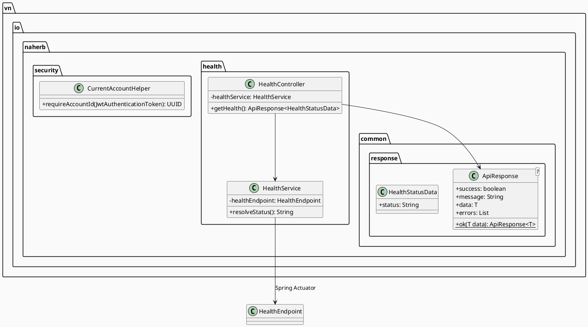
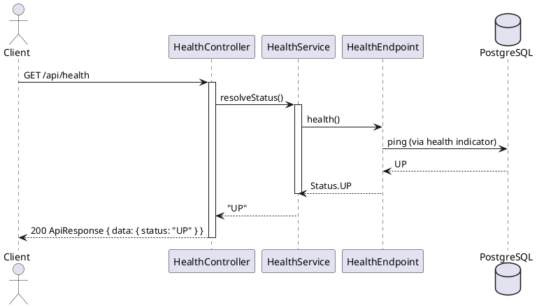

# ENGINEERING DOCUMENTATION STANDARD (EDS) v2.0
# NaHerbs — Phase 0 (Foundation) + Phase 1 (Health)

| Field | Value |
|-------|-------|
| **Document ID** | `NAHERB-FOUNDATION-IMP-001` |
| **Version** | `1.0` |
| **Date** | `2026-06-30` |
| **Status** | `In Review` |
| **Document Owner** | Tuấn Anh |
| **Author** | Tuấn Anh — Backend Developer |
| **Reviewed by** | `[ ] Tech Lead — Pending` |
| **DPO Sign-off** | `N/A` *(module Public — không xử lý PII)* |
| **Approved by** | `[ ] Principal Architect — Pending` |
| **Last Review** | `2026-06-30` |
| **Based on EDS** | `v2.0` |

---

## CHANGELOG

| Ngày | Người thực hiện | Nội dung thay đổi |
|------|-----------------|-------------------|
| 2026-06-30 | Tuấn Anh | Tạo tài liệu Phase 0 + Phase 1 (Foundation + Health) |
| 2026-06-30 | Tuấn Anh | Bổ sung tham chiếu Phase 2; sửa ADR CurrentAccountHelper (JWT sub = email) |

---

## MỤC LỤC

1. [Tổng quan Module](#1-tổng-quan-module)
2. [Ma trận Truy vết](#2-ma-trận-truy-vết-traceability-matrix)
3. [Architecture Decision Records](#3-architecture-decision-records-adr)
4. [Non-Functional Requirements & SLA](#4-non-functional-requirements--sla)
5. [Static Modeling](#5-static-modeling-mô-hình-tĩnh)
6. [Dynamic Modeling](#6-dynamic-modeling-mô-hình-động)
7. [Domain Event Catalog](#7-domain-event-catalog)
8. [Interface Specification](#8-interface-specification-đặc-tả-giao-diện)
9. [API Specification](#9-api-specification)
10. [Bảng mã lỗi](#10-bảng-mã-lỗi-error-codes)
11. [Quy trình Triển khai](#11-quy-trình-triển-khai-step-by-step)
12. [Rollback & Incident Runbook](#12-rollback--incident-runbook)
13. [Kịch bản Kiểm thử Chi tiết](#13-kịch-bản-kiểm-thử-chi-tiết)
14. [Phương pháp Xác minh](#14-phương-pháp-xác-minh)
15. [Mẫu thử thực tế](#15-mẫu-thử-thực-tế-api-verification-samples)
16. [Authorization Matrix](#16-bảng-tổng-hợp-phân-quyền-authorization-matrix)
17. [AI Prompt Constraints](#17-ai-prompt-constraints-case-20)

---

## 1. Tổng quan Module

| Field | Value |
|-------|-------|
| **Module Name** | `Foundation + Health` |
| **Bounded Context** | `Platform / Observability` |
| **Data Classification** | `Public` |
| **Compliance Scope** | `N/A` |
| **Upstream Dependencies** | Spring Boot Actuator, PostgreSQL, Redis |
| **Downstream Consumers** | Deploy pipeline (M9-06), Orval client `naherb-web`, các module Tuấn Anh (Profile, Address, Chatbot) |

**Mục đích:**

- **Phase 0:** Chuẩn hóa response envelope `ApiResponse<T>`, helper lấy `accountId` từ JWT, cập nhật `SecurityConfig` cho public routes.
- **Phase 1:** Expose `GET /api/health` khớp `docs/openapi.yml` và `api_endpoints_checklist.md`, bọc Actuator health thành format chuẩn SRS.

**Tech stack (hiện tại):**

| Layer | Stack |
|-------|-------|
| Backend | Spring Boot 3.5, Java 17, Spring Security JWT (HttpOnly cookie) |
| ORM | Spring Data JPA, Hibernate, schema `naherb` |
| Cache/Session | Redis (refresh token hash) |
| Frontend client | Next.js 16 + Orval + Axios (`NEXT_PUBLIC_API_BASE_URL`) |
| Contract | `docs/openapi.yml` v2.2.0 |

---

## 2. Ma trận Truy vết (Traceability Matrix)

| Requirement ID | Loại | Mô tả yêu cầu | Thành phần Code | Compliance Target | ADR |
|----------------|------|---------------|-----------------|-------------------|-----|
| SRS §3.2 | Interface | Response format `{ success, message, data, errors }` | `ApiResponse<T>` | — | ADR-001 |
| M1-01 / backlog | Milestone | `/health` OK khi chạy local | `HealthController`, `HealthService` | — | ADR-002 |
| M9-06 | Milestone | Health OK production | `GET /api/health` | — | ADR-002 |
| CHECKLIST | Task | `GET /health` (@TuanAnh) | `HealthController` | — | — |
| SRS §2.3 | Constraint | API base path `/api/v1` (SRS) vs `/api` (code hiện tại) | Document + dùng `/api` nhất quán với `AuthController` | — | ADR-003 |

---

## 3. Architecture Decision Records (ADR)

### ADR-001 — ApiResponse envelope cho business APIs

| Field | Value |
|-------|-------|
| **Status** | `Accepted` |
| **Deciders** | Tuấn Anh |
| **Date** | `2026-06-30` |

#### Bối cảnh
SRS §3.2 và OpenAPI định nghĩa response chuẩn. `AuthController` hiện trả DTO trực tiếp (legacy). Module mới (Health, Profile, Chatbot) dùng envelope thống nhất.

#### Quyết định
Tạo `vn.io.naherb.common.response.ApiResponse<T>` với factory `ok(data)`. Không refactor `AuthController` trong phase này.

#### Hệ quả
- Tích cực: Orval client và frontend parse nhất quán.
- Trade-off: Hai style response tồn tại song song tạm thời.

---

### ADR-002 — Health endpoint custom thay vì expose Actuator trực tiếp

| Field | Value |
|-------|-------|
| **Status** | `Accepted` |
| **Deciders** | Tuấn Anh |
| **Date** | `2026-06-30` |

#### Bối cảnh
Actuator đã map tại `/api/v1/health` (`application.properties`). OpenAPI/Orval expect `GET /health` relative to base URL `http://localhost:8080/api`.

#### Quyết định
`HealthService` gọi `HealthEndpoint` nội bộ, `HealthController` expose `GET /api/health` trả `ApiResponseHealth`. Actuator `/api/v1/health` vẫn `permitAll` cho ops.

---

### ADR-003 — API prefix `/api` (không `/api/v1`) cho controllers mới

| Field | Value |
|-------|-------|
| **Status** | `Accepted` |
| **Deciders** | Tuấn Anh |
| **Date** | `2026-06-30` |

#### Bối cảnh
SRS ghi `/api/v1`; `AuthController` dùng `/api/auth`; `api-client.ts` baseURL = `.../api`.

#### Quyết định
Controllers mới dùng `@RequestMapping("/api/...")`. Cập nhật OpenAPI server URL sau khi team thống nhất.

---

## 4. Non-Functional Requirements & SLA

### 4.1 Performance & Availability

| Category | Requirement | Target | Measurement |
|----------|-------------|--------|-------------|
| Latency | `GET /api/health` p99 | `< 100ms` | MockMvc / curl |
| Availability | Health probe | `200` khi DB+app UP | CI smoke |

### 4.2 Security

| Category | Requirement | Target |
|----------|-------------|--------|
| Access control | Health public | `permitAll`, không JWT |
| Information leak | Health response | Chỉ `status: UP/DOWN`, không lộ stack trace |

---

## 5. Static Modeling (Mô hình Tĩnh)

### 5.1 Class Diagram (PlantUML)



### 5.2 Data Structure (JPA — không có bảng mới)

Phase 0–1 không thêm migration. Health đọc runtime state từ Actuator (db, redis, diskSpace).

---

## 6. Dynamic Modeling (Mô hình Động)

### 6.1 Sequence Diagram — Happy Path



---

## 7. Domain Event Catalog

Phase 0–1 **không phát domain events**.

---

## 8. Interface Specification (Đặc tả Giao diện)

### 8.1 HealthService

```java
// @version 1.0
public interface HealthService {
    /**
     * @return "UP" hoặc "DOWN" theo Actuator aggregate health
     */
    String resolveStatus();
}
```

### 8.2 CurrentAccountHelper (Phase 0 — dùng cho Profile/Address sau)

```java
// @version 1.1 — JWT subject là email, không phải UUID
public final class CurrentAccountHelper {
    public static String requireAccountEmail(JwtAuthenticationToken authentication);
    public static UUID requireAccountId(
            JwtAuthenticationToken authentication, AccountRepository accountRepository);
}
```

> **Lưu ý:** `JwtService.createToken` đặt `sub = account.getEmail()`. Phase 2 đã cập nhật helper theo ADR-006 trong `PHASE-2_Account-Profile_EDS.md`.

---

## 9. API Specification

### 9.1 Endpoints Table

| Method | Path | Auth | Roles | Rate Limit | Idempotent |
|--------|------|------|-------|------------|------------|
| `GET` | `/api/health` | None | GUEST | N/A | Yes |

### 9.2 Response Schema — `GET /api/health`

**200 OK:**

```json
{
  "success": true,
  "message": "OK",
  "data": {
    "status": "UP"
  },
  "errors": []
}
```

**503 Service Unavailable** *(khi aggregate health DOWN — tùy chọn phase sau):*

```json
{
  "success": false,
  "message": "Service unavailable",
  "data": {
    "status": "DOWN"
  },
  "errors": []
}
```

---

## 10. Bảng mã lỗi (Error Codes)

| Code | HTTP | Message (EN) | Message (VI) | Trigger |
|------|------|--------------|--------------|---------|
| `HLT-001` | 503 | Service unavailable | Dịch vụ không khả dụng | Actuator status DOWN |
| `HLT-002` | 500 | Health check failed | Kiểm tra sức khỏe thất bại | Actuator exception |

---

## 11. Quy trình Triển khai (Step-by-Step)

### 11.1 Prerequisites

- [x] Docker Postgres + Redis (`docker compose up -d`)
- [x] `.env.backend` cấu hình
- [x] `docs/openapi.yml` có schema `ApiResponseHealth`

### 11.2 Implementation Steps

#### Chặng 1 — Phase 0 Foundation

```bash
cd naherb-api
# Tạo: common/response/ApiResponse.java
# Tạo: security/CurrentAccountHelper.java
# Sửa: config/SecurityConfig.java — permitAll /api/health, /api/v1/health
```

#### Chặng 2 — Phase 1 Health

```bash
# Tạo: health/HealthController.java, health/HealthService.java
mvn test -Dtest=HealthControllerTests
mvn spring-boot:run
curl http://localhost:8080/api/health
```

#### Chặng 3 — Verification

```bash
# Không cần cookie/JWT
curl -s http://localhost:8080/api/health | jq .
# Expected: success=true, data.status="UP"
```

### 11.3 Deployment Checklist

- [ ] `mvn test` pass
- [ ] `GET /api/health` → 200
- [ ] Security: anonymous access OK
- [ ] Tick checklist `api_endpoints_checklist.md`

---

## 12. Rollback & Incident Runbook

### 12.1 Trigger Conditions

| Điều kiện | Ngưỡng | Quyết định |
|-----------|--------|------------|
| Health luôn DOWN | > 3 phút | On-call |
| Health 500 | Bất kỳ | On-call |

### 12.2 Rollback Procedure

```bash
git revert <commit-hash-phase-0-1>
cd naherb-api && mvn spring-boot:run
curl http://localhost:8080/api/health
```

---

## 13. Kịch bản Kiểm thử Chi tiết

Xem chi tiết test cases trong `implement/PHASE-0-1_Foundation-Health_TDD.md`.

| TC ID | Mô tả |
|-------|-------|
| `HLT-TC-001` | GET /api/health không auth → 200, success=true, status=UP |
| `HLT-TC-002` | Response có `errors: []` |
| `SEC-TC-001` | GET /api/health không gửi JWT vẫn 200 |

---

## 14. Phương pháp Xác minh

```bash
# Local
curl -s http://localhost:8080/api/health

# Actuator (ops)
curl -s http://localhost:8080/api/v1/health
```

---

## 15. Mẫu thử thực tế (API Verification Samples)

```bash
curl -s http://localhost:8080/api/health
```

**Expected:**

```json
{
  "success": true,
  "message": "OK",
  "data": { "status": "UP" },
  "errors": []
}
```

---

## 16. Bảng tổng hợp phân quyền (Authorization Matrix)

| Endpoint | GUEST | USER | ADMIN |
|----------|-------|------|-------|
| `GET /api/health` | ✅ | ✅ | ✅ |

---

## 17. AI Prompt Constraints (CASE 2.0)

### 17.1 Constraint Summary

| # | Constraint | Source |
|---|-----------|--------|
| C1 | Response PHẢI dùng `ApiResponse<T>` với `errors` là empty list khi success | SRS §3.2, ADR-001 |
| C2 | Path controller: `/api/health` (không `/api/v1/health` cho business endpoint) | ADR-003 |
| C3 | Health KHÔNG yêu cầu JWT/CSRF | OpenAPI `security: []` |
| C4 | `HealthService` delegate tới `HealthEndpoint`, không hardcode UP | ADR-002 |
| C5 | Test dùng `@SpringBootTest` + `MockMvc` + H2 in-memory (pattern `AuthFlowIntegrationTests`) | TDD spec |

### 17.2 Constraint Injection Block

```
[CONSTRAINT BLOCK — Module: Foundation + Health]
Theo NAHERB-FOUNDATION-IMP-001:

1. Dùng ApiResponse.ok() cho success response.
2. Controller @RequestMapping("/api/health"), permitAll trong SecurityConfig.
3. Không yêu cầu authentication cho health.
4. HealthService gọi HealthEndpoint Actuator.
5. Test MockMvc, không PII, H2 profile test.

[TASK]
Implement Phase 0 + Phase 1 theo constraints trên.
```

---

## PHỤ LỤC

### B. Tài liệu tham chiếu

| Document | Path |
|----------|------|
| SRS | `docs/srs.md` |
| OpenAPI | `docs/openapi.yml` |
| API Checklist | `api_endpoints_checklist.md` |
| TDD Spec | `implement/PHASE-0-1_Foundation-Health_TDD.md` |
| **Phase 2 Profile EDS** | `implement/PHASE-2_Account-Profile_EDS.md` |
| **Phase 2 Profile TDD** | `implement/PHASE-2_Account-Profile_TDD.md` |
| **Phase 3 Addresses EDS** | `implement/PHASE-3_Account-Addresses_EDS.md` |
| **Phase 3 Addresses TDD** | `implement/PHASE-3_Account-Addresses_TDD.md` |
| Auth pattern | `naherb-api/.../auth/AuthController.java` |

---

*EDS v2.0 — NaHerbs Phase 0 + Phase 1 — Tuấn Anh*
