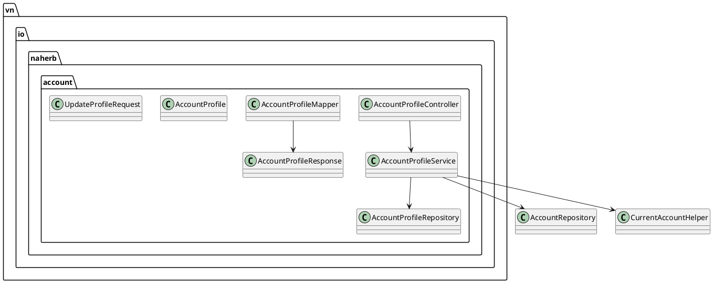

# ENGINEERING DOCUMENTATION STANDARD (EDS) v2.0
# NaHerbs — Phase 2 (Customer Profile)

| Field | Value |
|-------|-------|
| **Document ID** | `NAHERB-PROFILE-IMP-002` |
| **Version** | `1.0` |
| **Date** | `2026-06-30` |
| **Status** | `In Review` |
| **Document Owner** | Tuấn Anh |
| **Author** | Tuấn Anh — Backend Developer |
| **Based on EDS** | `v2.0` |
| **Depends on** | `NAHERB-FOUNDATION-IMP-001` (Phase 0–1) |

---

## CHANGELOG

| Ngày | Người thực hiện | Nội dung thay đổi |
|------|-----------------|-------------------|
| 2026-06-30 | Tuấn Anh | Tạo tài liệu Phase 2 — Customer Profile |
| 2026-06-30 | Tuấn Anh | Sửa `CurrentAccountHelper`: JWT `sub` = email, không phải UUID |

---

## 1. Tổng quan Module

| Field | Value |
|-------|-------|
| **Module Name** | `Customer Profile` |
| **Bounded Context** | `Account` |
| **Data Classification** | `PII` (fullName, phone, contactEmail) |
| **Upstream Dependencies** | Auth (JWT cookie), `AccountProfile` entity |
| **Downstream Consumers** | Checkout (Hoàng), Account UI (`naherb-web`) |

**Mục đích:** Cho phép customer đã đăng nhập xem và cập nhật hồ sơ liên hệ tách khỏi bảng `accounts` (login/security).

**Khác `/auth/me`:**

| Endpoint | Trả về |
|----------|--------|
| `GET /api/auth/me` | `UserResponse` — id, email, name, role, avatarUrl |
| `GET /api/account/profile` | `AccountProfile` — đầy đủ profile + timestamps |

---

## 2. Ma trận Truy vết

| Requirement ID | Loại | Mô tả | Thành phần Code | ADR |
|----------------|------|-------|-----------------|-----|
| SRS §3.2 | Interface | Response envelope | `ApiResponse<AccountProfileResponse>` | ADR-001 |
| CHECKLIST | Task | `GET /account/profile` | `AccountProfileController` | — |
| CHECKLIST | Task | `PUT /account/profile` | `AccountProfileService.updateProfile` | — |
| BR (implicit) | Business | Phone unique across profiles | `existsByPhoneAndAccount_IdNot` | ADR-004 |
| BR (implicit) | Business | Sync `accounts.name` khi đổi `fullName` | `AccountProfileService` | ADR-005 |

---

## 3. Architecture Decision Records

### ADR-004 — Phone uniqueness trên profile

**Quyết định:** `existsByPhoneAndAccount_IdNot(phone, accountId)` — cho phép giữ số cũ của chính user, chặn trùng user khác.

### ADR-005 — Đồng bộ `accounts.name` với `profile.fullName`

**Quyết định:** Khi `PUT /account/profile`, cập nhật `account.setName(fullName)` để `/auth/me` nhất quán.

### ADR-006 — Resolve account từ JWT email

**Bối cảnh:** `JwtService` đặt `sub = account.email`, không phải UUID.

**Quyết định:** `CurrentAccountHelper.requireAccountId(auth, accountRepository)` lookup email → UUID.

---

## 4. API Specification

### Endpoints

| Method | Path | Auth | CSRF |
|--------|------|------|------|
| `GET` | `/api/account/profile` | JWT cookie | Không (GET) |
| `PUT` | `/api/account/profile` | JWT cookie | Bắt buộc `X-XSRF-TOKEN` |

### `GET /api/account/profile` — 200

```json
{
  "success": true,
  "message": "OK",
  "data": {
    "accountId": "uuid",
    "fullName": "Tuấn Anh",
    "phone": "0901234567",
    "contactEmail": "contact@naherb.vn",
    "avatarUrl": null,
    "createdAt": "2026-06-30T03:00:00Z",
    "updatedAt": "2026-06-30T03:00:00Z"
  },
  "errors": []
}
```

### `PUT /api/account/profile` — Request

```json
{
  "fullName": "Tuấn Anh",
  "phone": "0901234567",
  "contactEmail": "contact@naherb.vn",
  "avatarUrl": "https://cdn.naherb.vn/avatar.png"
}
```

---

## 5. Static Modeling



### JPA — không migration mới

Dùng bảng `account_profiles` hiện có (`full_name`, `phone`, `contact_email`, `avatar_url`).

---

## 6. Bảng mã lỗi

| Code | HTTP | Message (VI) | Trigger |
|------|------|--------------|---------|
| `PRF-001` | 400 | Dữ liệu không hợp lệ | Validation fail |
| `PRF-002` | 401 | Chưa đăng nhập | Không có JWT |
| `PRF-003` | 404 | Không tìm thấy hồ sơ | Profile chưa tồn tại |
| `PRF-004` | 409 | Số điện thoại đã được sử dụng | Phone trùng user khác |

---

## 7. Authorization Matrix

| Endpoint | GUEST | USER (own) | ADMIN |
|----------|-------|------------|-------|
| `GET /api/account/profile` | ❌ | ✅ | ✅ |
| `PUT /api/account/profile` | ❌ | ✅ own | ❌* |

\* Admin profile CMS nằm ngoài scope MVP này.

---

## 8. Quy trình Triển khai

```bash
cd naherb-api
mvn test -Dtest=AccountProfileIntegrationTests
mvn spring-boot:run

# Sau khi login (cookie set):
curl -b cookies.txt http://localhost:8080/api/account/profile
```

---

## 9. AI Prompt Constraints (§17)

```
1. Response dùng ApiResponse.ok(AccountProfileResponse).
2. JWT subject là email — dùng CurrentAccountHelper + AccountRepository.
3. PUT yêu cầu CSRF header.
4. Validate UpdateProfileRequest với @Valid.
5. Phone conflict → ConflictException (409).
```

---

## PHỤ LỤC

| Document | Path |
|----------|------|
| Phase 0–1 EDS | `implement/PHASE-0-1_Foundation-Health_EDS.md` |
| Phase 2 TDD | `implement/PHASE-2_Account-Profile_TDD.md` |
| Phase 3 Addresses EDS | `implement/PHASE-3_Account-Addresses_EDS.md` |
| OpenAPI | `docs/openapi.yml` — `AccountProfile`, `UpdateProfileRequest` |

---

*EDS v2.0 — NaHerbs Phase 2 — Tuấn Anh*
