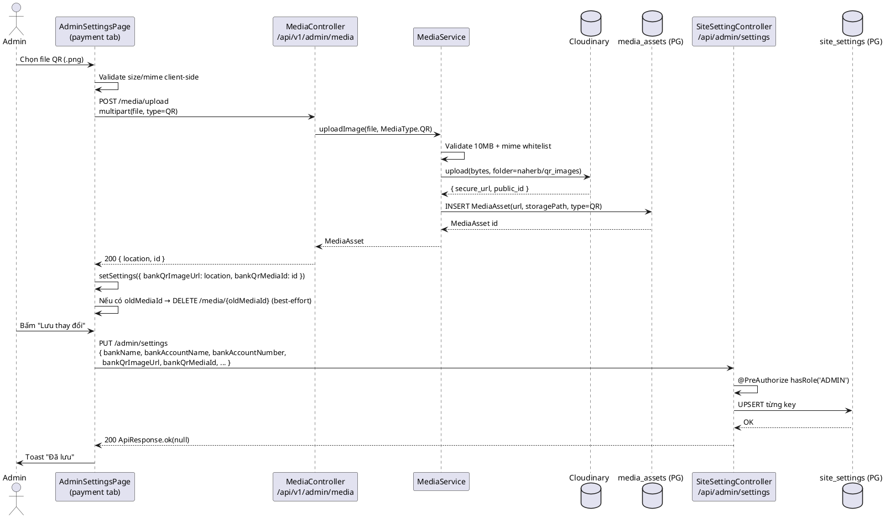
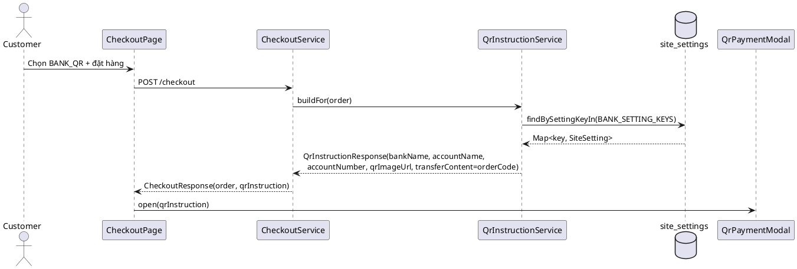
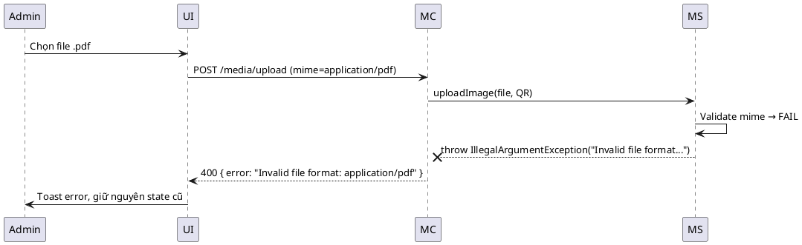

# ENGINEERING DOCUMENTATION STANDARD (EDS) v2.0
# NaHerbs — Phase 5 (Admin QR Payment Config — Upload ảnh QR + thông tin ngân hàng lên Cloudinary)

| Field | Value |
|-------|-------|
| **Document ID** | `NAHERB-QRCFG-IMP-005` |
| **Version** | `1.0` |
| **Date** | `2026-07-03` |
| **Status** | `In Review` |
| **Document Owner** | Tuấn Anh |
| **Author** | Tuấn Anh — Fullstack Developer |
| **Depends on** | `NAHERB-FOUNDATION-IMP-001` (Media/Cloudinary), `NAHERB-CHATBOT-IMP-004` (Admin settings pattern) |
| **Related** | `QrInstructionService`, `/admin/qr-payments` (transaction list — đã có) |

---

## CHANGELOG

| Ngày | Người thực hiện | Nội dung thay đổi |
|------|-----------------|-------------------|
| 2026-07-03 | Tuấn Anh | Tạo tài liệu Phase 5 — Admin config QR (bank + upload QR image → Cloudinary) |

---

## 1. Tổng quan Module

| Field | Value |
|-------|-------|
| **Module Name** | `Admin QR Payment Configuration` |
| **Bounded Context** | `Site Settings / Payment` |
| **Data Classification** | `Internal` (tên chủ TK, số TK ngân hàng của shop — không phải PII của khách) |
| **Upstream Dependencies** | `MediaService` (Cloudinary), `SiteSettingService`, `Admin Auth (JWT)` |
| **Downstream Consumers** | `QrInstructionService` → `QrPaymentModal` (checkout), `/tai-khoan/don-hang/[orderId]` |

**Mục tiêu Phase 5:** Cung cấp UI cho admin **upload / thay đổi ảnh QR chuyển khoản cố định** và **cập nhật thông tin ngân hàng** (tên NH, tên chủ TK, số TK). Ảnh QR được lưu trên **Cloudinary** (folder `naherb/qr_images/`), URL secure_url + media_id được persist vào bảng `site_settings` để `QrInstructionService` build lại `QrInstruction` cho khách khi checkout `BANK_QR`.

**Không thuộc phạm vi phase này:**
- Auto-đối soát ngân hàng (BR-06 — vẫn manual).
- Tạo QR động theo từng đơn (BR-06 — QR cố định).
- Sửa trang `/admin/qr-payments` (transaction list — đã có sẵn, sẽ reuse visual tokens).

---

## 2. Ma trận Truy vết

| Requirement ID | Loại | Mô tả | Thành phần Code | ADR |
|----------------|------|-------|-----------------|-----|
| FR-ADM-07 | SRS | Admin cập nhật thông tin ngân hàng và QR image | `AdminSettingsPage (payment tab)` + `PUT /api/admin/settings` | ADR-016 |
| BR-06 | SRS | QR là mã cố định | 1 URL duy nhất trong `site_settings.bankQrImageUrl` | ADR-016 |
| BR-11 | SRS | Chỉ admin mới cấu hình được | `SecurityConfig` `hasRole('ADMIN')` trên `/api/admin/**` + `/api/v1/admin/media/**` | — |
| BR-12 | SRS | Schema không tự thay đổi | Dùng bảng `site_settings` (key/value), không thêm bảng mới | ADR-017 |
| SRS §7.3 | NFR | Upload không log secret | `MediaService` không log filename/base64 | — |
| SRS §3.2 | NFR | Response API chuẩn `ApiResponse<T>` | `SiteSettingController` đã tuân thủ | — |

---

## 3. Architecture Decision Records

### ADR-016 — Reuse Cloudinary + `MediaType.QR`, không thêm storage riêng cho QR

**Bối cảnh:** Cần lưu ảnh QR có thể re-upload nhiều lần. Repo đã có Cloudinary tích hợp cho `PRODUCT`, `BLOG`, `LOGO`. Enum `MediaType.QR` **đã tồn tại** trong `common/enums/MediaType.java` nhưng chưa dùng.

| Phương án | Mô tả | Ưu | Nhược |
|-----------|-------|----|-----|
| A | Cloudinary + `MediaType.QR` (reuse) | Không cần code mới ở backend; đã có validate 10MB/mime; auto CDN | Phụ thuộc Cloudinary quota |
| B | Local disk (`AvatarStorageService` pattern) | Không phụ thuộc bên ngoài | Không CDN; deploy ephemeral filesystem sẽ mất file |
| C | Supabase Storage | Cùng vendor với DB | Thêm SDK mới; team chưa có kinh nghiệm |

**Quyết định:** **Phương án A**. Upload qua `POST /api/v1/admin/media/upload` với `type=QR` → `MediaService` tự lưu vào folder `naherb/qr_images/qr_<uuid>`.

**Hệ quả tích cực:** Không thêm dependency, không migration; frontend chỉ cần gọi endpoint sẵn có.

**Trade-off:** Khi Cloudinary down, admin không upload được ảnh mới → mitigation: ảnh cũ vẫn phục vụ khách vì đã có `secure_url` cached trong `site_settings`.

---

### ADR-017 — Dùng `site_settings` (key/value) thay vì bảng `payment_config` riêng

**Bối cảnh:** Cần lưu 5 field: `bankName`, `bankAccountName`, `bankAccountNumber`, `bankQrImageUrl`, `bankQrMediaId`. Đã có bảng `site_settings` dùng cho `store_name`, `store_phone`,…

| Phương án | Mô tả | Ưu | Nhược |
|-----------|-------|----|-----|
| A | Reuse `site_settings` (key/value) | Không migration; `QrInstructionService` đã đọc key camelCase | Không có typed column; validate ở app layer |
| B | Tạo bảng `payment_config` riêng | Typed columns, có constraint | Migration; thêm entity/repo; overkill cho 5 field |

**Quyết định:** **Phương án A**. Key naming **bắt buộc camelCase** để khớp với `QrInstructionService.BANK_SETTING_KEYS`.

**Hệ quả:** Ràng buộc key phải khớp — chỉ định trong `AdminSettingsPage.STORE_KEYS`.

---

### ADR-018 — Xoá ảnh Cloudinary cũ khi admin đổi ảnh mới

**Bối cảnh:** Mỗi lần admin upload ảnh mới, ảnh cũ nếu không xoá sẽ tồn đọng trên Cloudinary → tốn quota.

**Quyết định:** Lưu thêm `bankQrMediaId` (UUID của record trong `media_assets`). Khi upload mới thành công, gọi `DELETE /api/v1/admin/media/{oldMediaId}` (best-effort). Nếu delete lỗi → chỉ warn, không rollback upload mới.

**Trade-off:** Có thể phát sinh orphan asset khi delete fail. Chấp nhận vì tần suất thấp.

---

## 4. Non-Functional Requirements

| Category | Requirement | Target | Verification |
|----------|-------------|--------|--------------|
| File size | Max upload | ≤ 10 MB | `MediaService.uploadImage` throw `IllegalArgumentException` |
| File format | Whitelist | `image/jpeg`, `image/jpg`, `image/png`, `image/webp`, `image/gif` | `MediaService.uploadImage` |
| Latency | Upload → response | p95 < 3s (file ≤ 2MB, mạng nội bộ VN → Cloudinary AP region) | Manual QA |
| Availability | UI cấu hình | Không blocking (nếu backend fail thì chỉ tab payment lỗi, các tab khác vẫn dùng được) | UI catch error, giữ nguyên state |
| Security | Chỉ admin | `hasRole('ADMIN')` trên `/api/admin/**` và `/api/v1/admin/media/**` | Integration test 403 |
| Audit | Cloudinary log | Cloudinary Dashboard | Manual |

---

## 5. Static Modeling

### 5.1 Backend (reuse — không thêm code mới đáng kể)

```
vn.io.naherb.media/                (đã có — reuse)
├── MediaController        POST /api/v1/admin/media/upload
│                          DELETE /api/v1/admin/media/{id}
├── MediaService           uploadImage(file, MediaType) → MediaAsset
│                          deleteImage(UUID) → destroy Cloudinary + delete DB
├── MediaAsset             @Table("media_assets") — id, url, storagePath (public_id), type, mimeType, ...
└── MediaAssetRepository

vn.io.naherb.setting/              (đã có — reuse)
├── SiteSettingController  GET/PUT /api/admin/settings
│                          GET /api/v1/settings/site-info (public)
├── SiteSettingService     saveSettings(Map<String, String>)   ← upsert theo key
└── SiteSetting            @Table("site_settings") — settingKey UNIQUE, settingValue TEXT

vn.io.naherb.order/                (đã có — consumer)
└── QrInstructionService   buildFor(Order) reads: bankName, bankAccountName,
                                                   bankAccountNumber, bankQrImageUrl
```

### 5.2 Frontend (mới)

```
naherb-web/src/app/admin/settings/
└── page.tsx                        [MODIFIED]
    ├── STORE_KEYS += bankName, bankAccountName, bankAccountNumber,
    │                 bankQrImageUrl, bankQrMediaId
    ├── TABS += { id: "payment", label: "Thanh toán QR", icon: "qr_code_2" }
    └── <QrPaymentConfigSection>    [NEW inline hoặc extract]

naherb-web/src/components/admin/settings/  (tuỳ chọn tách file)
└── QrPaymentConfigSection.tsx      [NEW]
    props: { settings, onChange, isLoading, showToast }
    hooks: useState(uploading), useState(previewUrl)
    render:
      - Warning banner (BR-06)
      - 3 input text (bank fields)
      - Image uploader (drag-drop hoặc click)
      - Preview panel (mock modal khách nhìn thấy)
```

### 5.3 Data model — bảng `site_settings` (không migration)

| setting_key | value_type | Ví dụ | Bắt buộc? |
|-------------|-----------|-------|-----------|
| `bankName` | `TEXT` | `Vietcombank` | Yes |
| `bankAccountName` | `TEXT` | `CONG TY NAHERBS` | Yes |
| `bankAccountNumber` | `TEXT` | `0123456789` | Yes |
| `bankQrImageUrl` | `TEXT` | `https://res.cloudinary.com/xxx/image/upload/.../qr_<uuid>.png` | Yes |
| `bankQrMediaId` | `TEXT` | `550e8400-e29b-41d4-a716-446655440000` (UUID trong `media_assets`) | No (dùng để xoá ảnh cũ) |

> **Key phải camelCase** để khớp `QrInstructionService.BANK_SETTING_KEYS` (đọc `bankName / bank.name / bank_name` — camelCase là canonical form được Frontend gửi).

---

## 6. Dynamic Modeling

### 6.1 Sequence — Upload / Update ảnh QR (Happy path)



### 6.2 Sequence — Consumer đọc ảnh QR (checkout BANK_QR)



### 6.3 Error path — Upload fail



---

## 7. Interface Specification

### 7.1 Frontend — component contract (mới)

```typescript
// QrPaymentConfigSection.tsx — @version 1.0

export type QrPaymentSettingKey =
  | "bankName"
  | "bankAccountName"
  | "bankAccountNumber"
  | "bankQrImageUrl"
  | "bankQrMediaId";

export interface QrPaymentSettings {
  bankName: string;
  bankAccountName: string;
  bankAccountNumber: string;
  bankQrImageUrl: string;
  bankQrMediaId: string;
}

export interface QrPaymentConfigSectionProps {
  settings: QrPaymentSettings;
  onChange: (key: QrPaymentSettingKey, value: string) => void;
  isLoading: boolean;
  showToast: (msg: string, kind: "success" | "error") => void;
}
```

### 7.2 Backend — endpoints reuse

| Method | Path | Auth | Body | Response |
|--------|------|------|------|----------|
| `POST` | `/api/v1/admin/media/upload` | `ROLE_ADMIN` | `multipart/form-data` (`file`, `type=QR`) | `200 { "location": "<secure_url>", "id": "<uuid>" }` |
| `DELETE` | `/api/v1/admin/media/{id}` | `ROLE_ADMIN` | — | `200` (idempotent — không tồn tại vẫn 200) |
| `GET` | `/api/admin/settings` | `ROLE_ADMIN` | — | `200 ApiResponse<Map<String,String>>` |
| `PUT` | `/api/admin/settings` | `ROLE_ADMIN` | `Map<String,String>` | `200 ApiResponse<Void>` |

**Không thêm endpoint mới.**

---

## 8. Bảng mã lỗi

| Code | HTTP | Message (EN) | Message (VI) | Trigger |
|------|------|--------------|--------------|---------|
| `QR-CFG-001` | 400 | File size exceeds 10MB limit | Ảnh vượt quá 10MB | `MediaService.uploadImage` — `file.getSize() > 10MB` |
| `QR-CFG-002` | 400 | Invalid file format | Định dạng ảnh không hợp lệ (chỉ JPG/PNG/WEBP/GIF) | `MediaService.uploadImage` — mime whitelist fail |
| `QR-CFG-003` | 500 | Failed to upload image | Không upload được ảnh lên Cloudinary | `IOException` từ Cloudinary SDK |
| `QR-CFG-004` | 400 | Missing required bank fields | Thiếu thông tin ngân hàng bắt buộc | Frontend validation trước PUT settings |
| `QR-CFG-005` | 403 | Insufficient permissions | Không đủ quyền | Non-admin gọi `/api/v1/admin/media/**` |

> Mã `QR-CFG-001/002/003` do `MediaController` return sẵn dưới dạng `{ "error": "<message>" }` — frontend hiển thị trực tiếp qua `Toast`.

---

## 9. Authorization Matrix

| Endpoint | `GUEST` | `USER` | `ADMIN` |
|----------|---------|--------|---------|
| `POST /api/v1/admin/media/upload` | ❌ 401 | ❌ 403 | ✅ |
| `DELETE /api/v1/admin/media/{id}` | ❌ 401 | ❌ 403 | ✅ |
| `GET /api/admin/settings` | ❌ 401 | ❌ 403 | ✅ |
| `PUT /api/admin/settings` | ❌ 401 | ❌ 403 | ✅ |
| `GET /api/v1/settings/site-info` (public) | ✅ | ✅ | ✅ (không expose bank fields) |

> **Guard bổ sung:** `SiteSettingController.getPublicSiteInfo()` **không** whitelist các key `bank*` → khách không đọc được bank info qua public endpoint.

---

## 10. UI Component Specification (dựa vào HTML mẫu)

### 10.1 Design tokens (kế thừa từ HTML admin QR Payments)

| Token | Giá trị | Dùng cho |
|-------|---------|----------|
| `bg-surface-container-lowest` | `#ffffff` | Card body |
| `bg-surface-container-low` | `#f9f3e7` | Section header, hover state |
| `bg-surface-container-high` | `#ede8dc` | Code/badge background |
| `border-border-warm` | `#DDD0BC` | Card border, table divider |
| `bg-primary` / `text-on-primary` | `#37563b` / `#ffffff` | Nút chính (Lưu, Chọn ảnh) |
| `text-primary` | `#37563b` | Tiêu đề section |
| `text-earth-brown` | `#8A6A4F` | Badge "Chờ xác nhận" (không dùng ở tab này) |
| `bg-error-bg` / `text-error-text` | `#FBEAE5` / `#B94A3A` | Warning banner + nút xoá |
| `text-text-muted` | `#6F6A61` | Placeholder, description |
| `font-headline-md` | Inter 32/1.35/600 | Page title |
| `font-label-md` | Inter 15/1.2/600 | Button label |
| `font-body-md` | Inter 16/1.5/400 | Input text |
| `rounded-xl` | `1.5rem` (24px) | Card |
| `rounded-full` | `9999px` | Nút chính |
| Icon | Material Symbols Outlined | `qr_code_2`, `upload_file`, `delete`, `save` |

### 10.2 Structure — Tab "Thanh toán QR"

```
<main class="flex-1 p-gutter">
  ── Page Header ──────────────────────────────────
  <h2 font-headline-md text-primary>Cài đặt cửa hàng</h2>
  [Save Button — reuse]

  ── Tab Nav (reuse) ─────────────────────────────
  [general] [contact] [payment ★] [social] [seo]

  ── Warning Banner (BR-06 reminder) ─────────────
  <div bg-error-bg border-error-container rounded-xl p-sm flex gap-sm>
    <span material-icon:warning text-error-text>
    <div>
      <h4 font-label-md text-error-text>Lưu ý quan trọng</h4>
      <p font-body-md text-error-text/80>
        QR là mã cố định. Sau khi đổi ảnh, khách hàng mới checkout sẽ
        thấy ảnh mới. Đơn cũ chưa thanh toán vẫn giữ ảnh QR tại thời
        điểm đặt hàng.
      </p>
    </div>
  </div>

  ── Section Card: Thông tin ngân hàng ───────────
  <SectionCard title="Thông tin ngân hàng" icon="account_balance">
    <SettingField label="Tên ngân hàng"     fieldKey="bankName"          icon="account_balance"/>
    <SettingField label="Tên chủ tài khoản" fieldKey="bankAccountName"   icon="person"/>
    <SettingField label="Số tài khoản"      fieldKey="bankAccountNumber" icon="numbers"/>
  </SectionCard>

  ── Section Card: Ảnh QR chuyển khoản ───────────
  <SectionCard title="Ảnh QR chuyển khoản" icon="qr_code_2">
    <div md:col-span-2 grid grid-cols-1 md:grid-cols-2 gap-md>
      <!-- LEFT: Uploader / Preview ─────────────────────────── -->
      <div>
        {bankQrImageUrl
          ? <ImagePreviewWithActions
              src={bankQrImageUrl}
              onReplace={handleQrUpload}
              onRemove={handleRemoveQr}
            />
          : <EmptyDropzone onSelect={handleQrUpload}/>}
      </div>

      <!-- RIGHT: Customer-view preview mock ─────────────────── -->
      <div rounded-xl border border-border-warm bg-surface-container-low p-md>
        <p font-caption text-text-muted mb-xs>Khách sẽ nhìn thấy</p>
        <div bg-white rounded-lg p-sm flex flex-col items-center>
          
          <p font-label-md text-primary mt-xs>{bankName || "—"}</p>
          <p font-body-md text-text-main>{bankAccountName || "—"}</p>
          <code bg-surface-container-high px-2 py-1 rounded font-mono text-earth-brown>
            {bankAccountNumber || "—"}
          </code>
        </div>
      </div>
    </div>
  </SectionCard>
</main>
```

### 10.3 EmptyDropzone (chưa có ảnh)

```
<label class="flex h-48 w-full cursor-pointer flex-col items-center justify-center
             rounded-xl border-2 border-dashed border-border-warm
             bg-surface-container-low/50 hover:border-primary hover:bg-surface-container-low
             transition-colors">
  <span class="material-symbols-outlined text-[40px] text-text-muted">upload_file</span>
  <span class="mt-xs font-label-md text-label-md text-text-main">Chọn ảnh QR</span>
  <span class="font-caption text-caption text-text-muted mt-1">
    PNG / JPG / WEBP, tối đa 10MB
  </span>
  <input type="file" accept="image/png,image/jpeg,image/webp" class="hidden"
         onChange={(e) => handleQrUpload(e.target.files?.[0])}/>
</label>
```

### 10.4 ImagePreviewWithActions (đã có ảnh)

```
<div class="rounded-xl border border-border-warm bg-white p-md flex gap-md items-start">
  
  <div class="flex flex-col gap-xs flex-1">
    <label class="cursor-pointer inline-flex items-center gap-xs
                  rounded-full bg-primary text-on-primary px-md py-sm
                  font-label-md text-label-md hover:bg-surface-tint transition-colors shadow-sm">
      <span class="material-symbols-outlined text-[18px]">swap_horiz</span>
      Đổi ảnh khác
      <input type="file" ... class="hidden"/>
    </label>
    <button type="button" onClick={onRemove}
            class="inline-flex items-center gap-xs rounded-full border border-error-text/40
                   text-error-text px-md py-sm font-label-md text-label-md
                   hover:bg-error-container/50 transition-colors">
      <span class="material-symbols-outlined text-[18px]">delete</span>
      Xoá ảnh
    </button>
    <p class="font-caption text-caption text-text-muted mt-xs">
      Kéo thả ảnh mới lên khung bên trái để thay thế nhanh.
    </p>
  </div>
</div>
```

### 10.5 Loading / uploading state

- Trong lúc upload: overlay `bg-white/70 backdrop-blur-sm` + spinner `material-symbols-outlined animate-spin progress_activity`.
- Disable nút "Đổi ảnh khác" và "Xoá ảnh".

---

## 11. Quy trình Triển khai

### 11.1 Prerequisites

- [x] `MediaController`, `MediaService`, `CloudinaryConfig` đã có (Foundation).
- [x] `MediaType.QR` đã tồn tại trong enum.
- [x] `SiteSettingController` `PUT /api/admin/settings` đã upsert được key/value bất kỳ.
- [x] `.env.backend` có `CLOUDINARY_CLOUD_NAME`, `CLOUDINARY_API_KEY`, `CLOUDINARY_API_SECRET`.
- [ ] Admin đã đăng nhập được với `ROLE_ADMIN` và có JWT.

### 11.2 Implementation Steps

#### Bước 1 — Frontend: mở rộng `STORE_KEYS` + `DEFAULT_SETTINGS`

`naherb-web/src/app/admin/settings/page.tsx`:

```ts
const STORE_KEYS = [
  // ... existing
  "bankName",
  "bankAccountName",
  "bankAccountNumber",
  "bankQrImageUrl",
  "bankQrMediaId",
] as const;
```

Đảm bảo `DEFAULT_SETTINGS` có default `""` cho tất cả 5 key mới.

#### Bước 2 — Thêm tab mới

```ts
type TabId = "general" | "contact" | "payment" | "social" | "seo";

const TABS = [
  { id: "general", label: "Thông tin chung", icon: "storefront" },
  { id: "contact", label: "Liên hệ & Địa chỉ", icon: "contact_phone" },
  { id: "payment", label: "Thanh toán QR",   icon: "qr_code_2" },   // NEW
  { id: "social",  label: "Mạng xã hội",     icon: "share" },
  { id: "seo",     label: "SEO cơ bản",      icon: "travel_explore" },
];
```

#### Bước 3 — Handler upload / delete QR

```ts
const [isUploadingQr, setIsUploadingQr] = useState(false);

const handleQrUpload = async (file: File) => {
  if (!file) return;
  if (file.size > 10 * 1024 * 1024) {
    showToast("Ảnh vượt quá 10MB", "error");
    return;
  }
  setIsUploadingQr(true);
  try {
    const oldMediaId = settings.bankQrMediaId;
    const form = new FormData();
    form.append("file", file);
    form.append("type", "QR");
    const res = await AXIOS_INSTANCE.post("/v1/admin/media/upload", form);
    const location = res.data?.location as string;
    const id = res.data?.id as string;
    setSettings((prev) => ({
      ...prev,
      bankQrImageUrl: location,
      bankQrMediaId: id,
    }));
    setIsDirty(true);
    if (oldMediaId) {
      AXIOS_INSTANCE
        .delete(`/v1/admin/media/${oldMediaId}`)
        .catch((err) => console.warn("Không xoá được ảnh QR cũ:", err));
    }
    showToast("Đã tải ảnh QR mới", "success");
  } catch (err: any) {
    const msg = err?.response?.data?.error ?? "Upload ảnh thất bại";
    showToast(msg, "error");
  } finally {
    setIsUploadingQr(false);
  }
};

const handleRemoveQr = async () => {
  const oldMediaId = settings.bankQrMediaId;
  setSettings((prev) => ({ ...prev, bankQrImageUrl: "", bankQrMediaId: "" }));
  setIsDirty(true);
  if (oldMediaId) {
    AXIOS_INSTANCE
      .delete(`/v1/admin/media/${oldMediaId}`)
      .catch((err) => console.warn("Không xoá được ảnh QR:", err));
  }
};
```

#### Bước 4 — Render tab payment

Xem cấu trúc chi tiết ở §10. Include:
1. Warning banner (BR-06).
2. `<SectionCard title="Thông tin ngân hàng" icon="account_balance">` chứa 3 `<SettingField>` cho `bankName`, `bankAccountName`, `bankAccountNumber`.
3. `<SectionCard title="Ảnh QR chuyển khoản" icon="qr_code_2">` chứa uploader/preview + customer-view mock.

#### Bước 5 — Save

Nút "Lưu thay đổi" (đã có sẵn) sẽ tự PUT toàn bộ `settings` map lên `/admin/settings`. Backend upsert.

#### Bước 6 — Verification

```bash
# 6.1. Cloudinary Dashboard → folder naherb/qr_images/qr_<uuid>.png tồn tại
# 6.2. Supabase psql
SELECT setting_key, setting_value
FROM naherb.site_settings
WHERE setting_key IN
  ('bankName','bankAccountName','bankAccountNumber','bankQrImageUrl','bankQrMediaId');

# 6.3. Curl kiểm tra QrInstruction đọc đúng (checkout với BANK_QR sau đó)
curl -s https://api.naherbs.local/api/orders/my/<order-id> \
  -H "Authorization: Bearer <customer-jwt>" | jq '.data.qrInstruction'
# Expected: có bankName, accountName, accountNumber, qrImageUrl trỏ về Cloudinary URL
```

### 11.3 Deployment Checklist

- [ ] Cloudinary env vars có mặt trên production.
- [ ] Admin login được và thấy tab "Thanh toán QR".
- [ ] Upload thử ảnh QR ≤ 10MB — Cloudinary có file.
- [ ] Đổi ảnh khác — ảnh cũ bị xoá khỏi Cloudinary (kiểm tra Dashboard).
- [ ] Checkout thử với `BANK_QR` — modal hiện ảnh vừa upload.

---

## 12. Rollback & Incident Runbook

### 12.1 Trigger conditions

| Điều kiện | Ngưỡng | Xử lý |
|-----------|--------|-------|
| Ảnh QR không load ở modal khách | Bất kỳ report nào | Kiểm tra `bankQrImageUrl` trong `site_settings`; kiểm tra Cloudinary URL còn sống |
| Upload trả 500 liên tục > 5 phút | 3 lần liên tiếp | Kiểm tra Cloudinary API status, xác nhận API key chưa expire |
| Non-admin gọi được `/v1/admin/media/upload` | Bất kỳ case nào | **Incident P0** — Kiểm tra `SecurityConfig` `hasRole('ADMIN')` |

### 12.2 Rollback procedure

Vì không có schema migration, rollback chỉ cần revert code:

```bash
git revert <commit-hash-of-phase-5-frontend>
```

Nếu ảnh QR mới bị hỏng nhưng ảnh cũ đã bị xoá khỏi Cloudinary:
1. Admin upload lại ảnh QR khác qua UI.
2. Hoặc chỉnh trực tiếp `bankQrImageUrl` trong Supabase về Cloudinary URL cũ (nếu còn snapshot).

---

## 13. Kịch bản Kiểm thử

> Chi tiết đầy đủ trong `PHASE-5_Admin-QR-Config_TDD.md`.

### 13.1 Unit tests (backend — mostly reuse)

- `MediaService.uploadImage(QR)` — validate size/mime → asset saved with `type=QR`
- `MediaService.deleteImage(id)` — Cloudinary destroy + DB delete
- `SiteSettingService.saveSettings` — upsert 5 key mới

### 13.2 Integration tests

- `POST /api/v1/admin/media/upload` với `type=QR` bằng JWT admin → 200 + `location`
- `POST /api/v1/admin/media/upload` không auth → 401
- `POST /api/v1/admin/media/upload` với user thường → 403
- `PUT /api/admin/settings` upsert 5 bank key → verify `SELECT` từ `site_settings`
- `QrInstructionService.buildFor(order BANK_QR)` sau khi seed 4 key → trả về `QrInstructionResponse` đúng

### 13.3 Frontend tests

- `<QrPaymentConfigSection>` render empty state (chưa có ảnh) → hiện dropzone
- `<QrPaymentConfigSection>` render filled state (có ảnh) → hiện preview + 2 nút
- Chọn file `.pdf` → toast error, không gọi API
- Chọn file > 10MB → toast error, không gọi API

### 13.4 E2E manual

- Admin login → `/admin/settings` → tab "Thanh toán QR" → điền 3 field + upload PNG → Lưu → refresh trang → dữ liệu vẫn còn.
- Đăng nhập customer → thêm SP → checkout `BANK_QR` → modal QR hiện đúng ảnh + số TK vừa cấu hình.

---

## 14. Constraints Injection Block (CASE 2.0)

```
[CONSTRAINT BLOCK — Module: Admin QR Payment Configuration]
Theo TDS NAHERB-QRCFG-IMP-005 và các ADR liên quan:

1. (C1 / ADR-016) Upload ảnh QR PHẢI dùng `POST /api/v1/admin/media/upload`
   với `type=QR`. KHÔNG tạo endpoint mới, KHÔNG upload trực tiếp từ browser
   lên Cloudinary bằng signed preset.

2. (C2 / ADR-017) 5 key sau PHẢI được lưu vào `site_settings` với chính xác
   tên camelCase: `bankName`, `bankAccountName`, `bankAccountNumber`,
   `bankQrImageUrl`, `bankQrMediaId`. KHÔNG dùng snake_case hoặc kebab-case
   ở phía frontend.

3. (C3 / ADR-018) Khi admin thay ảnh QR, PHẢI gọi
   `DELETE /api/v1/admin/media/{oldMediaId}` best-effort SAU KHI upload mới
   thành công. Nếu delete fail chỉ được `console.warn`, KHÔNG rollback
   upload mới.

4. (C4 / BR-11) Mọi endpoint cấu hình PHẢI yêu cầu `ROLE_ADMIN`. KHÔNG
   thêm exception path cho `/api/admin/settings` hoặc `/api/v1/admin/media/**`
   trong `SecurityConfig`.

5. (C5 / BR-06) Frontend PHẢI hiển thị warning banner nhắc BR-06 (QR cố định).
   KHÔNG được thêm chức năng tự đối soát ngân hàng hoặc auto-verify payment.

6. (C6 / NFR §7.3) KHÔNG log filename, base64 content, hay Cloudinary API
   response body ra stdout/logger. Chỉ log status code và duration.

[CONTEXT BLOCK]
- Bounded Context: Site Settings / Payment
- Existing services: MediaService (Cloudinary), SiteSettingService
- Consumer service: QrInstructionService (KHÔNG được sửa)
- Error codes: §8
- Auth matrix: §9
- UI tokens: §10.1 (bám theo HTML admin QR Payments)

[TASK BLOCK]
Implement tab "Thanh toán QR" trong /admin/settings thoả mãn constraints trên.
Không sửa backend nếu không thực sự cần thiết.
Tests theo §13 + PHASE-5_Admin-QR-Config_TDD.md.
```

---

## 15. Glossary

| Thuật ngữ | Định nghĩa |
|-----------|------------|
| **QR cố định** | Mã QR duy nhất cho tài khoản shop, không đổi theo từng đơn (BR-06). |
| **Cloudinary public_id** | Định danh file trên Cloudinary — dùng để destroy khi replace. Lưu vào `MediaAsset.storagePath`. |
| **`site_settings`** | Bảng key/value chung cho cấu hình động không cần typed schema. |
| **`bankQrMediaId`** | UUID của record `media_assets` chứa ảnh QR hiện hành — dùng để `DELETE` khi replace. |

---

*EDS v1.0 — NaHerbs Phase 5 (Admin QR Payment Config) — Tuấn Anh*
*Bám templates/PHASE-3_EDS.md + SRS FR-ADM-07 + BR-06 / BR-11 / BR-12.*
