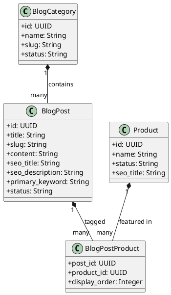
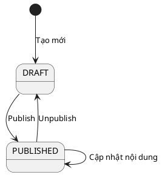

# ENGINEERING DOCUMENTATION STANDARD (EDS) v2.0
# Quy chuẩn Tài liệu Kỹ thuật và Đặc tả Hiện thực hóa - Module Blog & SEO

| Field | Value |
|-------|-------|
| **Document ID** | `NAHERB-CMS-IMP-001` |
| **Version** | `1.1` |
| **Date** | `2026-06-30` |
| **Status** | `Draft` |
| **Document Owner** | `Content Management Team` |
| **Author** | `Antigravity` |
| **Reviewed by** | `Tech Lead` |
| **DPO Sign-off** | `[x] Approved — Không chứa PII nhạy cảm` |
| **Approved by** | `Principal Architect` |
| **Last Review** | `2026-06-30` |
| **Based on EDS** | `v2.0` |

---

## CHANGELOG

> **Policy 4.4 — Immutable History:** Không bao giờ xóa thông tin cũ. Mọi thay đổi phải ghi vào bảng này.

| Ngày | Người thực hiện | Nội dung thay đổi |
|------|-----------------|-------------------|
| 2026-06-30 | Antigravity | Tạo tài liệu lần đầu cho tính năng Blog & SEO |
| 2026-06-30 | Antigravity | Bổ sung rules nghiệp vụ, xử lý ảnh nội dung (TinyMCE + Cloudinary), Cache Redis và liên kết sản phẩm. |

---

## MỤC LỤC

1. [Tổng quan Module](#1-tổng-quan-module)
2. [Ma trận Truy vết (Traceability Matrix)](#2-ma-trận-truy-vết-traceability-matrix)
3. [Architecture Decision Records (ADR)](#3-architecture-decision-records-adr)
4. [Non-Functional Requirements & SLA](#4-non-functional-requirements--sla)
5. [Static Modeling (Mô hình Tĩnh)](#5-static-modeling-mô-hình-tĩnh)
6. [Dynamic Modeling (Mô hình Động)](#6-dynamic-modeling-mô-hình-động)
7. [Domain Event Catalog](#7-domain-event-catalog)
8. [Interface Specification (Đặc tả Giao diện)](#8-interface-specification-đặc-tả-giao-diện)
9. [API Specification](#9-api-specification)
10. [Bảng mã lỗi (Error Codes)](#10-bảng-mã-lỗi-error-codes)
11. [Quy trình Triển khai (Step-by-Step)](#11-quy-trình-triển-khai-step-by-step)
12. [Rollback & Incident Runbook](#12-rollback--incident-runbook)
13. [Kịch bản Kiểm thử Chi tiết](#13-kịch-bản-kiểm-thử-chi-tiết)
14. [Phương pháp Xác minh](#14-phương-pháp-xác-minh)
15. [Mẫu thử thực tế (API Verification Samples)](#15-mẫu-thử-thực-tế-api-verification-samples)
16. [Bảng tổng hợp phân quyền (Authorization Matrix)](#16-bảng-tổng-hợp-phân-quyền-authorization-matrix)
17. [AI Prompt Constraints (CASE 2.0)](#17-ai-prompt-constraints-case-20)

---

## 1. Tổng quan Module

> Quản lý toàn bộ nội dung bài viết (Blog), chuyên mục (Category), tích hợp SEO (Search Engine Optimization) và liên kết sản phẩm (Products) vào bài viết để hỗ trợ quá trình Inbound Marketing.

| Field | Value |
|-------|-------|
| **Module Name** | `Blog & SEO Management` |
| **Bounded Context** | `Content Management (CMS)` |
| **Data Classification** | `Public` |
| **Compliance Scope** | `N/A (Chỉ quản lý nội dung công khai)` |
| **Upstream Dependencies** | `Product Catalog, Media Assets` |
| **Downstream Consumers** | `Storefront (Next.js Frontend), Search Engine Bots` |

---

## 2. Ma trận Truy vết (Traceability Matrix)

| Requirement ID | Loại | Mô tả yêu cầu | Thành phần Code | Compliance Target | ADR liên quan |
|----------------|------|---------------|-----------------|-------------------|---------------|
| BR-SEO-001 | Business Rule | Mọi bài viết và sản phẩm phải có trường SEO Title, Meta Description, Primary Keyword | `BlogPost.java`, `Product.java` | SEO Standard | ADR-001 |
| BR-BLG-002 | Business Rule | Bài viết có thể liên kết trực tiếp với tối đa 6 sản phẩm | `BlogPostProduct.java` | Marketing | ADR-002 |
| US-BLG-003 | User Story | Admin có thể tạo chuyên mục và xuất bản bài viết qua TinyMCE | `BlogController.java` | — | ADR-003 |

---

## 3. Architecture Decision Records (ADR)

### ADR-001 — Quản lý Meta SEO tích hợp trực tiếp vào Entity

| Field | Value |
|-------|-------|
| **Status** | `Accepted` |
| **Deciders** | `Tech Lead, SEO Manager` |
| **Date** | `2026-06-30` |

#### Quyết định (Decision)
Chọn **Phương án Nhúng trực tiếp (Embed fields)** vào bảng `blog_posts` và `products` (thay vì tách riêng bảng `seo_metadata`).
- `seo_title`: Tối đa 60 ký tự. Vượt quá trả về lỗi Validation.
- `seo_description`: Tối đa 160 ký tự. Vượt quá trả về lỗi Validation.

### ADR-002 — Bảng liên kết Many-to-Many cho Bài viết và Sản phẩm

| Field | Value |
|-------|-------|
| **Status** | `Accepted` |
| **Deciders** | `Tech Lead` |
| **Date** | `2026-06-30` |

#### Quyết định (Decision)
Tạo bảng `blog_post_products` liên kết `blog_posts` (id) và `products` (id).
- **Giới hạn số lượng**: Tối đa 6 sản phẩm được phép gắn vào 1 blog. Quá giới hạn API trả lỗi Validation.
- **Trạng thái Sản phẩm**: Blog API public chỉ trả về các sản phẩm có trạng thái `ACTIVE` hoặc `OUT_OF_STOCK`. Sản phẩm `INACTIVE` hoặc `DELETED` sẽ tự động bị ẩn khỏi danh sách hiển thị trên Blog để tránh trải nghiệm xấu.

### ADR-003 — Quản lý ảnh nội dung (Inline Images) trong Blog

| Field | Value |
|-------|-------|
| **Status** | `Accepted` |
| **Deciders** | `Tech Lead` |
| **Date** | `2026-06-30` |

#### Quyết định (Decision)
Không sử dụng bảng phụ cho ảnh nội dung bài viết.
- **Backend/DB**: Trường `content` lưu trữ nguyên HTML.
- **Upload**: Sử dụng TinyMCE upload qua API backend riêng. Upload đẩy trực tiếp lên Cloudinary. URL trả về được chèn vào ``. Giới hạn 5MB/ảnh, cho phép các định dạng: jpg, jpeg, png, webp.
- **Vòng đời file rác**: Khi upload ảnh chưa lưu bài viết, ảnh mang trạng thái `TEMP`. Khi Admin ấn Lưu bài viết, Backend parse HTML để kiểm tra:
  - Nếu thẻ `` xuất hiện trong HTML -> Mark `ATTACHED`.
  - Nếu thẻ `` không có (bị Admin xóa) -> Mark `ORPHANED` hoặc `PENDING_DELETE`.
  - Scheduled job sẽ tự động xóa các ảnh `PENDING_DELETE` khỏi Cloudinary sau 7 ngày. Không xóa ngay lập tức vì Admin có thể undo hoặc khôi phục bản nháp.

---

## 4. Non-Functional Requirements & SLA

### 4.1. Performance & Availability

| Category | Requirement | Target SLA | Measurement Method | Compliance Basis |
|----------|-------------|------------|---------------------|------------------|
| Caching | Redis Cache cho Public APIs | 10m TTL cho list, 30m TTL cho detail | Cache hit ratio | API Performance |
| Latency | API response for Blog lists (p99) | `< 200ms` | k6 load test | SEO Core Web Vitals |

*Quy tắc Invalidate Cache: Xóa cache khi Admin Create/Update/Publish/Unpublish/Delete/Change slug bài viết. Nếu Redis sập, API sẽ fallback đọc từ DB trực tiếp.*

---

## 5. Static Modeling (Mô hình Tĩnh)

### 5.1. Class Diagram (PlantUML)



---

## 6. Dynamic Modeling (Mô hình Động)

### 6.1. State Machine (Vòng đời bài viết)



*Lưu ý: Luôn có tính năng "Preview" nội dung Draft trên Frontend Admin để kiểm tra layout trước khi Publish.*

---

## 8. Interface Specification (Đặc tả Giao diện)

### 8.1. Service Interface (Java)

```java
public interface IBlogService {
    BlogPostDTO getPostBySlug(String slug);
    Page<BlogPostDTO> listPosts(Pageable pageable, String categorySlug);
    BlogPostDTO createPost(CreatePostInput input);
    void linkProducts(UUID postId, List<UUID> productIds); // Max 6 IDs
}
```

---

## 9. API Specification

| Method | Path | Auth Level | Required Roles | Rate Limit | Idempotent? |
|--------|------|------------|----------------|------------|-------------|
| `GET` | `/api/v1/blogs` | None | `Public` | 1000/min | Yes |
| `GET` | `/api/v1/blogs/{slug}` | None | `Public` | 1000/min | Yes |
| `POST` | `/api/v1/admin/blogs` | JWT Bearer | `ADMIN` | 60/min | No |

---

## 10. Bảng mã lỗi (Error Codes)

| Code | HTTP Status | Message (EN) | Message (VI) | Trigger Condition |
|------|-------------|--------------|--------------|-------------------|
| `BLG-001` | 400 | Invalid slug format | Đường dẫn không hợp lệ | Slug chứa ký tự đặc biệt |
| `BLG-002` | 409 | Slug already exists | Đường dẫn đã tồn tại | Trùng slug trong hệ thống |
| `BLG-003` | 404 | Post not found | Không tìm thấy bài viết | Tìm bài viết không tồn tại |
| `BLG-004` | 400 | SEO length exceeded | Quá độ dài cho phép của SEO meta | seo_title > 60 hoặc seo_description > 160 |
| `BLG-005` | 400 | Max products linked | Đã vượt số lượng sản phẩm liên kết tối đa | Link quá 6 products vào 1 blog |
| `BLG-006` | 400 | Invalid image upload | Tệp hình ảnh tải lên không hợp lệ | Kích thước > 5MB hoặc sai định dạng |

---

## 17. AI Prompt Constraints (CASE 2.0)

| # | Constraint | Source (ADR/BR) | Last Verified |
|---|-----------|-----------------|---------------|
| C1 | Luôn trả về `seo_title`, `seo_description`, `primary_keyword` trong API chi tiết sản phẩm/bài viết | `BR-SEO-001` | `2026-06-30` |
| C2 | Generate `slug` tự động từ `title` nếu admin không nhập. Nếu trùng thì nối hậu tố `-2`, `-3`. | `BR-BLG-001` | `2026-06-30` |
| C3 | Nếu Admin nhập thủ công `slug` và bị trùng, API báo lỗi `409 Conflict`. Không tự ý đổi slug nếu cập nhật title để giữ nguyên URL cũ. | `BR-BLG-001` | `2026-06-30` |
| C4 | Giới hạn SEO: `seo_title` max 60 ký tự, `seo_description` max 160 ký tự. Vượt quá báo lỗi 400. | `BR-SEO-001` | `2026-06-30` |
| C5 | Sử dụng trình soạn thảo **TinyMCE**. API upload giới hạn 5MB, JPG/JPEG/PNG/WEBP. Lưu HTML vào trường `content`. | `ADR-003` | `2026-06-30` |
| C6 | Liên kết sản phẩm (Many-to-many): Giới hạn tối đa 6 sản phẩm/bài. Blog API Public bỏ lọc các sản phẩm `INACTIVE` hoặc `DELETED`. | `ADR-002` | `2026-06-30` |
| C7 | Public Blog API (`/api/v1/blogs` và `/{slug}`) phải đọc từ Redis cache (TTL 10m/30m). Có invalidation handler. | `NFR` | `2026-06-30` |
